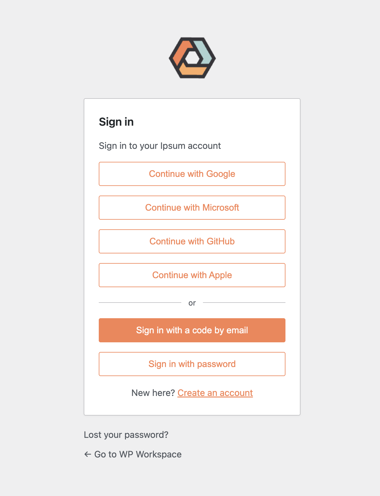
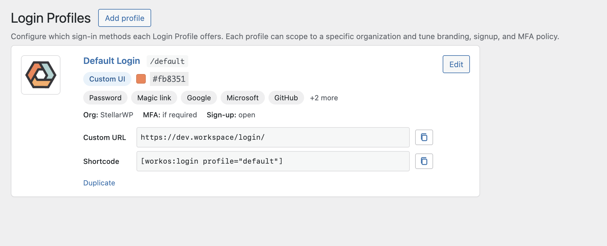
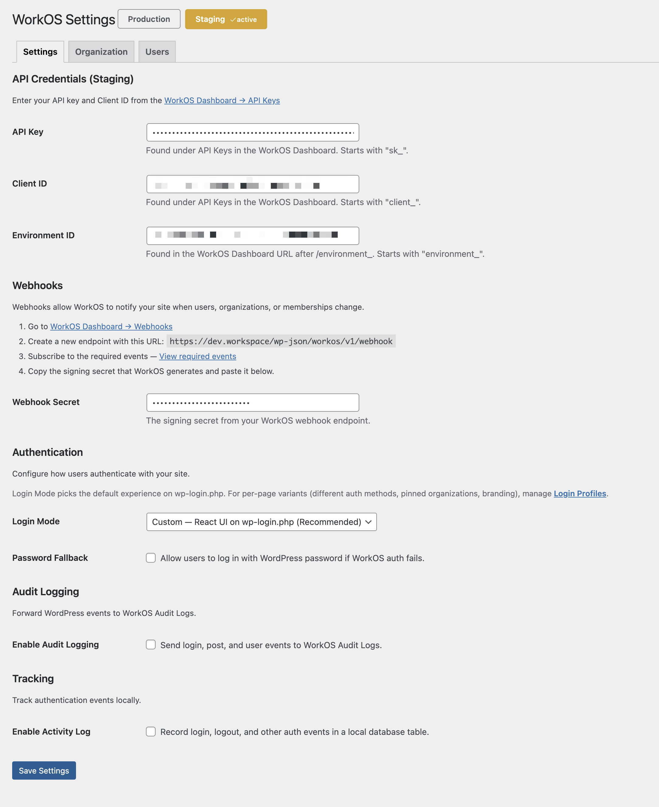
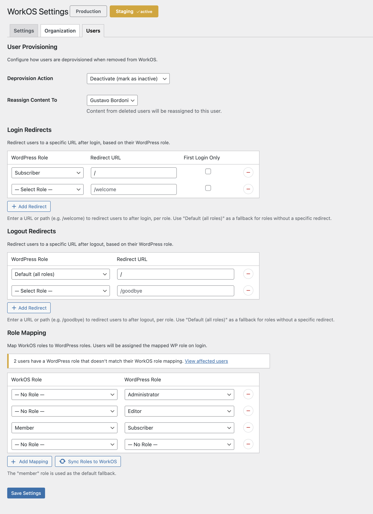

# Integration with WorkOS

Enterprise identity management for WordPress powered by [WorkOS](https://workos.com). SSO, directory sync, MFA, and user management.

**Requires PHP:** 7.4+
**Requires WordPress:** 5.9+
**License:** GPL-2.0-or-later

## Features

### Custom AuthKit (WordPress-hosted login)

- **React login shell** on wp-login.php, `[workos:login]` shortcode, and a dedicated `/workos/login/{profile}` route — all driven by the same TypeScript bundle
- **Login Profiles** — admin-defined presets (enabled methods, pinned organization, signup/invite/reset toggles, MFA policy, branding) managed through a React admin editor at **WorkOS → Login Profiles**
- **Sign-in methods**: email + password, magic code, social OAuth (Google, Microsoft, GitHub, Apple), passkey
- **In-app flows**: self-serve sign-up with email verification, invitation acceptance, password reset
- **MFA** — TOTP, SMS, WebAuthn/passkey with full enrollment + challenge UI; profile-level `mfa.enforce` (`never` / `if_required` / `always`) and factor allowlist
- **Profile routing rules** — ordered `redirect_to` glob / `referrer_host` / `user_role` matchers pick the right profile per request
- **WorkOS Radar** anti-fraud integration — browser SDK supplies an action token the plugin forwards on every server-side auth call
- **No WorkOS PHP SDK** — every WorkOS call is `wp_remote_request` from PHP, so the API key never leaves the server

### Base platform

- **Single Sign-On (SSO)** via WorkOS AuthKit — redirect or headless login modes (legacy path, selectable per-profile)
- **Directory Sync (SCIM)** — automatic user provisioning and deprovisioning from your identity provider
- **Role Mapping** — map WorkOS organization roles to WordPress roles
- **Organization Management** — local caching of WorkOS organizations with multisite support
- **Entitlement Gate** — require organization membership to log in
- **Webhook Processing** — real-time sync of user, organization, and directory events
- **REST API Authentication** — Bearer token auth for headless/decoupled WordPress
- **Legacy Login Button** — Gutenberg block and classic widget (AuthKit-redirect flow)
- **Login Bypass** — access the native WordPress login form via `?fallback=1` when WorkOS is unavailable
- **Activity Logging** — local database table with admin viewer for tracking authentication and sync events
- **Audit Logging** — forward WordPress events (login, logout, post changes, user changes) to WorkOS Audit Logs
- **Role-Based Login Redirects** — send users to different URLs after login based on their WordPress role
- **Role-Based Logout Redirects** — send users to different URLs after logout based on their WordPress role
- **Password Reset Integration** — redirect password reset to WorkOS or fall back to WordPress
- **Registration Redirect** — redirect registration to WorkOS AuthKit
- **Admin Bar Badge** — shows the active WorkOS environment (production/staging) in the admin bar
- **Changelog Page** — in-admin changelog viewer rendered from CHANGELOG.md
- **Diagnostics Page** — system health checks and configuration status
- **Onboarding Wizard** — guided setup for initial plugin configuration and user sync
- **WP-CLI Commands** — full CLI access for scripting, bulk operations, and diagnostics

## Screenshots

| Custom AuthKit login | Login Profiles | WorkOS settings | Role mapping &amp; redirects |
| :---: | :---: | :---: | :---: |
| <a href=".wordpress-org/screenshot-1.png"></a> | <a href=".wordpress-org/screenshot-2.png"></a> | <a href=".wordpress-org/screenshot-3.png"></a> | <a href=".wordpress-org/screenshot-4.png"></a> |
| Branded login your site visitors see — logo, brand color, and the sign-in methods you enable. | Pick sign-in methods, pin an organization, set MFA policy, brand each card without code. | Switch Production / Staging, manage API credentials, and pick the login mode. | Map WorkOS roles to WP roles and send users to role-specific URLs. |

## Installation

### From a Release ZIP

1. Download the latest `.zip` from the [Releases](https://github.com/bordoni/integration-workos/releases) page.
2. In WordPress admin, go to **Plugins > Add New > Upload Plugin** and upload the ZIP file.
3. Activate the plugin.
4. Navigate to **Settings > WorkOS** to configure.

### From Source (Development)

1. Clone the repository into `wp-content/plugins/integration-workos/`.
2. Run `composer install` to install PHP dependencies.
3. Run `bun install && bun run build` to install JS dependencies and build assets.
4. Activate the plugin in WordPress admin.
5. Navigate to **Settings > WorkOS** to configure.

## Configuration

### Admin UI

Go to **Settings > WorkOS** in the WordPress admin. The settings page has three tabs:

| Tab | Contents |
|---|---|
| **Settings** | API Key, Client ID, Environment ID, webhook secret, login mode, password fallback, audit logging toggle |
| **Organization** | Select or create a WorkOS organization |
| **Users** | Deprovision action, content reassignment, role mapping table |

The plugin supports two environments — **Production** and **Staging** — with separate credentials for each. An admin bar badge shows which environment is active.

### wp-config.php Constants

All credentials can be set via constants in `wp-config.php`, which take precedence over database values:

```php
// Generic (used for any environment)
define( 'WORKOS_API_KEY', 'sk_live_...' );
define( 'WORKOS_CLIENT_ID', 'client_...' );
define( 'WORKOS_WEBHOOK_SECRET', 'whsec_...' );
define( 'WORKOS_ORGANIZATION_ID', 'org_...' );
define( 'WORKOS_ENVIRONMENT_ID', 'environment_...' );
define( 'WORKOS_ENVIRONMENT', 'production' ); // Lock active environment

// Per-environment (takes priority over generic)
define( 'WORKOS_PRODUCTION_API_KEY', 'sk_live_...' );
define( 'WORKOS_STAGING_API_KEY', 'sk_test_...' );
```

## Authentication

The plugin ships three login modes. Each Login Profile picks its `mode`:
`custom` uses the React shell, `authkit_redirect` uses the legacy redirect
path. `login_mode=headless` (global) remains available for custom forms.

### Custom Mode — React shell (default for the `default` Login Profile)

`wp-login.php?action=login` is intercepted on `login_init` and the React shell
renders in its place. All other actions — `logout`, `register`,
`lostpassword`, `resetpass`, `confirmaction`, `postpass`, `?fallback=1`,
`?workos=0` — pass through to core WP so WooCommerce, WP-CLI password
resets, and email confirmation links keep working.

The shell also mounts on `[workos:login profile="slug"]` and the
`/workos/login/{profile}` rewrite. Every mount reads configuration from
`data-*` attributes emitted by `Auth\AuthKit\Renderer` and talks to
`/wp-json/workos/v1/auth/*` for everything — no WorkOS calls are proxied
through the browser.

### AuthKit-Redirect Mode (legacy)

Set a Login Profile's `mode` to `authkit_redirect` and `wp-login.php` sends
users to WorkOS's hosted AuthKit. WorkOS returns to `/workos/callback` where
the plugin exchanges the authorization code. Use this mode for SSO
(SAML/OIDC) or any profile that needs WorkOS-hosted UX.

### Headless Mode

The plugin intercepts WordPress's `authenticate` filter and validates
credentials directly against the WorkOS API using email and password. This
mode is useful for custom login forms you render yourself.

### Password Fallback

When enabled, WordPress native password authentication remains available
alongside WorkOS. Password reset and registration forms fall back to
WordPress defaults.

### Login Bypass

If WorkOS is down or misconfigured, users can access the native WordPress
login form by appending `?fallback=1` to the login URL. This bypasses the
WorkOS redirect — and the React shell takeover — entirely.

## Login Profiles

A Login Profile is a stored configuration unit that governs a single login
entry point. Manage profiles under **WorkOS → Login Profiles** (React
editor backed by `/wp-json/workos/v1/admin/profiles`).

Each profile stores:

| Field                    | Purpose                                                          |
|--------------------------|------------------------------------------------------------------|
| `slug`                   | URL-friendly id; reserved `default` drives wp-login.php takeover |
| `custom_path`            | Optional arbitrary URL path (e.g. `members`, `team/login`, `login`) that mounts the same React shell — see "Custom paths" below. Empty means only `/workos/login/{slug}` is registered. Available on every profile, including the reserved `default` (when set, `/wp-login.php?action=login` 302s to it) |
| `title`                  | Admin-facing label                                               |
| `methods[]`              | Enabled sign-in methods (any subset of `password`, `magic_code`, `oauth_google`, `oauth_microsoft`, `oauth_github`, `oauth_apple`, `passkey`) |
| `organization_id`        | Server-side pinned WorkOS org; passed on auth calls              |
| `signup`                 | `{enabled, require_invite}` — toggles self-serve signup          |
| `invite_flow`            | Allow invitation acceptance                                      |
| `password_reset_flow`    | Allow in-app password reset                                      |
| `mfa`                    | `{enforce: never|if_required|always, factors: [totp,sms,webauthn]}` |
| `branding`               | `{logo_mode, logo_attachment_id, primary_color, heading, subheading}` — `logo_mode` is `default` / `custom` / `none` (see "Logo modes" in [`docs/extending-the-login-ui.md`](docs/extending-the-login-ui.md)) |
| `post_login_redirect`    | URL the React shell navigates to on success (beats `redirect_to`)|
| `forward_query_args`     | When `true`, appends safe inbound query args (`utm_*`, `ref`, custom params — never `redirect_to`, `_wpnonce`, `loggedout`, `wp_lang`, `workos_*`, etc.) to the post-login destination |
| `mode`                   | `custom` (React) or `authkit_redirect` (legacy)                  |

The `branding.logo` field defaults to the WordPress Site Icon when no
per-profile logo is set. See
[`docs/extending-the-login-ui.md`](docs/extending-the-login-ui.md) for the
full developer guide on injecting React elements (SlotFill), enqueuing
per-profile CSS/JS, and the available PHP filters.

### Custom paths

Any profile (including the reserved `default`) can claim an arbitrary
URL path on top of the canonical `/workos/login/{slug}` rewrite. Set
the **Custom path** field in the editor to e.g. `members` and
`https://yoursite.com/members/` mounts the same React shell. The
shortcode `[workos:login profile="members"]` keeps working too.

- Both URLs are always live — adding a custom path never disables the
  canonical `/workos/login/{slug}` rewrite.
- When the **default** profile owns a non-empty `custom_path`,
  `/wp-login.php?action=login` 302s to it with every inbound `$_GET`
  preserved (so `redirect_to`, `interim-login`, `reauth`, `instance`,
  `wp_lang`, etc. survive the bounce). `?loggedout`, `?fallback=1`,
  `LoginBypass`, and non-`login` actions short-circuit the redirect.
- Reserved segments (`wp-admin`, `wp-includes`, `wp-content`, `wp-json`,
  `workos`, `feed`, `comments`, `trackback`) are rejected at save time
  so you can't shadow core URLs. `login`, `admin`, and `signin` are
  intentionally allowed so the default profile can bounce
  `/wp-login.php` to a clean URL.
- Saving a profile triggers exactly one soft `flush_rewrite_rules( false )`
  on the next request when the custom-path set actually changes
  (signature stored in the `workos_custom_paths_signature` option).

### Already signed-in visitors

A visitor that hits any AuthKit surface (wp-login.php takeover,
`/workos/login/{slug}`, a custom path) while logged in is 302'd
straight to their post-login destination. The precedence is centralized
in `Auth\AuthKit\LoginRedirector::for_visitor( Profile $profile )`:
profile `post_login_redirect` → validated `redirect_to` → `admin_url()`.
The `[workos:login]` shortcode can't redirect from inside `the_content`
(headers are already sent), so it renders an inline "You're already
signed in as {name}. [Continue]" notice that links to the same URL.

### Profile routing rules

Rules stored under the `workos_profile_routing_rules` option pick the right
profile when no slug is explicit. Each rule is
`{ profile: slug, matcher: { type, value } }` where `type` is one of
`redirect_to` (glob), `referrer_host` (exact host), or `user_role` (role slug).
Rules evaluate top-down; first match wins; the `default` profile is the
fallback.

### MFA policy

Profile-level MFA enforcement is applied by `Auth\AuthKit\LoginCompleter`:

- `enforce: never` — single-step login is always accepted
- `enforce: if_required` (default) — MFA step surfaces when WorkOS returns
  a pending factor; otherwise single-step is accepted
- `enforce: always` — single-step success is rejected with
  `workos_authkit_mfa_required`; the user must enroll a factor first

Factor types WorkOS returns in a pending-factor response are checked against
the profile's `mfa.factors` allowlist; disallowed types are rejected.

### WorkOS Radar

Set `workos_radar_site_key` (plugin option) or define
`WORKOS_RADAR_SITE_KEY` to enable Radar. The React shell loads
`https://radar.workos.com/v1/radar.js`, fetches an action token, and the
plugin forwards it as `X-WorkOS-Radar-Action-Token` on every
user-management auth call, so WorkOS can score the attempt server-side.

## Webhooks

Configure your WorkOS dashboard to send webhooks to:

```
https://yoursite.com/wp-json/workos/v1/webhook
```

The plugin processes these event types:

| Category | Events |
|---|---|
| **Users** | `user.created`, `user.updated`, `user.deleted` |
| **Directory Sync** | `dsync.user.created`, `dsync.user.updated`, `dsync.user.deleted`, `dsync.group.user_added`, `dsync.group.user_removed` |
| **Organizations** | `organization.created`, `organization.updated` |
| **Memberships** | `organization_membership.created`, `organization_membership.updated`, `organization_membership.deleted` |
| **Connections** | `connection.activated`, `connection.deactivated`, `connection.deleted` |
| **Auth** | `authentication.email_verification_succeeded` |

All events are verified against the webhook signing secret before processing.

## REST API Authentication

The plugin adds Bearer token authentication to the WordPress REST API. Send the WorkOS access token in the `Authorization` header:

```
Authorization: Bearer <workos_access_token>
```

The token is verified using WorkOS JWKS and mapped to a WordPress user via their linked WorkOS ID.

## Helpers for Third-Party Integrations

The plugin exposes a stable, read-only API for checking WorkOS state on
a WP user so integrations don't need to know what meta keys the plugin
stores. Everything lives in `WorkOS\User` (instance-free static class)
with matching global function shortcuts.

### `WorkOS\User` methods

| Method                                | Returns  | Purpose                                                |
|---------------------------------------|----------|--------------------------------------------------------|
| `User::is_sso( $user_id = 0 )`        | `bool`   | User is linked to a WorkOS identity (persistent)       |
| `User::has_active_session( $user_id = 0 )` | `bool` | User currently has a stored WorkOS access token       |
| `User::get_workos_id( $user_id = 0 )` | `string` | WorkOS `user_...` identifier, or `''`                  |
| `User::get_access_token( $user_id = 0 )` | `string` | Current WorkOS access token (treat as opaque)       |
| `User::get_refresh_token( $user_id = 0 )` | `string` | Stored WorkOS refresh token                         |
| `User::get_session_id( $user_id = 0 )` | `string` | WorkOS `sid` claim for the active session             |
| `User::get_organization_id( $user_id = 0 )` | `string` | WorkOS organization id pinned to the user        |
| `User::snapshot( $user_id = 0 )`      | `array`  | All of the above in one predictable payload            |

All methods accept `0` (or omitted) to target the currently-authenticated
user. All return empty strings / `false` safely when no user is available,
so there's no need to null-check `get_current_user_id()` first.

The meta keys are also exposed as constants (`User::META_WORKOS_ID`,
`META_ACCESS_TOKEN`, etc.) for callers that need them in SQL queries or
REST schemas.

### Global function shortcuts

```php
workos_is_sso_user( $user_id = 0 );       // bool   — is the user linked?
workos_has_active_session( $user_id = 0 ); // bool  — is a session stored?
workos_get_user_id( $user_id = 0 );       // string — WorkOS user id
workos_get_access_token( $user_id = 0 );  // string — current access token
```

### Distinguishing "linked" vs "currently signed in"

- **`is_sso()`** remains true after the user logs out. Use it when you
  want to know whether an account was ever provisioned via WorkOS.
- **`has_active_session()`** flips to false on `wp_logout` (the plugin
  clears the access token server-side). Use it when you want to know
  whether a request is running under a live WorkOS session.

### Example: augment a REST response payload

```php
use WorkOS\User;

add_filter( 'my_plugin_response', function ( array $data ): array {
    if ( ! User::is_sso() ) {
        return $data;
    }

    $data['workos'] = [
        'linked'          => true,
        'active_session'  => User::has_active_session(),
        'workos_user_id'  => User::get_workos_id(),
        'organization_id' => User::get_organization_id(),
    ];

    return $data;
} );
```

Or with the function shortcuts inside a non-namespaced file:

```php
function my_plugin_add_workos_data( array $data ): array {
    if ( ! workos_has_active_session() ) {
        return $data;
    }

    $data['workos_user_id'] = workos_get_user_id();
    // ...
    return $data;
}
```

Note: neither helper verifies that the access token is still valid
against WorkOS's JWKS. If you need authoritative session state (e.g.
before authorizing a sensitive action), verify via
`workos()->api()->verify_access_token( $token )`.

## Hooks Reference

### Filters

#### `workos_redirect_urls`

Filter the full role-to-redirect entry map from settings. Each entry is an array with `url` (string) and `first_login_only` (bool). Allows adding, removing, or overriding entries programmatically.

**Parameters:**

- `array $map` — Associative array of WordPress role slug to redirect entry (`['url' => string, 'first_login_only' => bool]`).

**Example:**

```php
add_filter( 'workos_redirect_urls', function ( $map ) {
    $map['subscriber'] = [ 'url' => '/welcome', 'first_login_only' => true ];
    return $map;
} );
```

#### `workos_redirect_url`

Filter the final redirect URL for a specific user. Return an empty string to skip the role-based redirect.

**Parameters:**

- `string $url` — The role-based redirect URL (empty if no match).
- `WP_User $user` — The authenticated user.
- `string $role` — The user's primary WordPress role.
- `bool $is_first_login` — Whether this is the user's first login via WorkOS.

**Example:**

```php
add_filter( 'workos_redirect_url', function ( $url, $user, $role, $is_first_login ) {
    if ( $role === 'editor' ) {
        return '/editor-guide';
    }
    return $url;
}, 10, 4 );
```

#### `workos_redirect_should_apply`

Whether the role-based redirect should apply at all for this request. Return `false` to skip entirely.

**Parameters:**

- `bool $should_apply` — Whether to apply the role-based redirect (default `true`).
- `WP_User $user` — The authenticated user.
- `string $requested_redirect` — The current redirect URL.

**Example:**

```php
add_filter( 'workos_redirect_should_apply', function ( $should_apply, $user ) {
    // Never redirect administrators.
    if ( in_array( 'administrator', $user->roles, true ) ) {
        return false;
    }
    return $should_apply;
}, 10, 2 );
```

#### `workos_redirect_is_explicit`

Whether the current `redirect_to` value is considered "explicit" (user-initiated). By default, any `redirect_to` that is not `admin_url()` or empty is treated as explicit, meaning the role-based redirect is skipped in favor of the user's intended destination.

**Parameters:**

- `bool $is_explicit` — Whether the redirect is explicit.
- `string $redirect_to` — The redirect URL.
- `WP_User $user` — The authenticated user.

#### `workos_redirect_first_login_only`

Override the per-entry "first login only" setting programmatically.

**Parameters:**

- `bool $first_login_only` — Whether to redirect only on first login.
- `string $role` — The user's primary WordPress role.
- `WP_User $user` — The authenticated user.

#### `workos_logout_redirect_urls`

Filter the full role-to-logout-redirect URL map from settings. Unlike login redirects, each entry is a simple URL string (no `first_login_only` option).

**Parameters:**

- `array $map` — Associative array of WordPress role slug to logout redirect URL (string).

**Example:**

```php
add_filter( 'workos_logout_redirect_urls', function ( $map ) {
    $map['subscriber'] = '/goodbye';
    $map['editor']     = '/editor-farewell';
    return $map;
} );
```

#### `workos_logout_redirect_url`

Filter the final logout redirect URL for a specific user. Return an empty string to skip the role-based logout redirect.

**Parameters:**

- `string $url` — The role-based logout redirect URL (empty if no match).
- `WP_User $user` — The authenticated user.
- `string $role` — The user's primary WordPress role.

**Example:**

```php
add_filter( 'workos_logout_redirect_url', function ( $url, $user, $role ) {
    if ( $role === 'administrator' ) {
        return '/admin-logged-out';
    }
    return $url;
}, 10, 3 );
```

#### `workos_logout_redirect_should_apply`

Whether the role-based logout redirect should apply at all for this request. Return `false` to skip entirely.

**Parameters:**

- `bool $should_apply` — Whether to apply the role-based logout redirect (default `true`).
- `WP_User $user` — The authenticated user.
- `string $redirect_to` — The current logout redirect URL.

**Example:**

```php
add_filter( 'workos_logout_redirect_should_apply', function ( $should_apply, $user ) {
    // Never redirect administrators on logout.
    if ( in_array( 'administrator', $user->roles, true ) ) {
        return false;
    }
    return $should_apply;
}, 10, 2 );
```

### Actions

#### `workos_user_created`

Fires when a brand-new WordPress user is created via WorkOS authentication. Does NOT fire for email-match auto-links (existing users matched by email).

**Parameters:**

- `int $user_id` — WordPress user ID.
- `array $workos_user` — WorkOS user data array.

#### `workos_redirect_before`

Fires just before a role-based login redirect is applied.

**Parameters:**

- `string $url` — The redirect URL.
- `WP_User $user` — The authenticated user.
- `bool $is_first_login` — Whether this is the user's first login via WorkOS.

#### `workos_redirect_skipped`

Fires when a role-based login redirect is skipped. Useful for logging or debugging redirect behavior.

**Parameters:**

- `WP_User $user` — The authenticated user.
- `string $reason` — Reason the redirect was skipped. One of: `filtered_out`, `explicit_redirect`, `not_first_login`, `no_matching_role_url`.

#### `workos_logout_redirect_before`

Fires just before a role-based logout redirect is applied.

**Parameters:**

- `string $url` — The logout redirect URL.
- `WP_User $user` — The authenticated user.

#### `workos_logout_redirect_skipped`

Fires when a role-based logout redirect is skipped.

**Parameters:**

- `WP_User $user` — The authenticated user.
- `string $reason` — Reason the logout redirect was skipped. One of: `filtered_out`, `no_matching_role_url`.

#### `workos_login_profile_saved`

Fires after a Login Profile is created or updated through the admin REST
API (`/wp-json/workos/v1/admin/profiles`).

**Parameters:**

- `WorkOS\Auth\AuthKit\Profile $profile` — The saved profile (post-validation, with assigned ID).

#### `workos_login_profile_deleted`

Fires after a Login Profile is deleted through the admin REST API. Useful
for invalidating caches or rewrite-rule signatures keyed on profile data
(this is exactly how `Auth\AuthKit\FrontendRoute` knows to rebuild its
custom-path rewrites).

**Parameters:**

- `WorkOS\Auth\AuthKit\Profile $profile` — The profile that was deleted.

## Database Tables

The plugin creates four custom tables on activation:

| Table | Purpose |
|---|---|
| `{prefix}_workos_organizations` | Cached WorkOS organization data (name, slug, domains) |
| `{prefix}_workos_org_memberships` | User-to-organization memberships with roles |
| `{prefix}_workos_org_sites` | Organization-to-site mapping (multisite) |
| `{prefix}_workos_activity_log` | Local activity log for authentication and sync events |

User linking is stored in standard WordPress usermeta (`_workos_user_id`, `_workos_org_id`, `_workos_last_synced_at`, `_workos_deactivated`).

## WP-CLI Commands

All commands are registered under the `wp workos` namespace.

### Status

```bash
# Show plugin configuration and health
wp workos status

# Output as JSON
wp workos status --format=json
```

Displays: environment, API key (masked), client ID, organization ID, environment ID, enabled status, login mode, database version, and plugin version. The `source` column shows whether each value comes from a `constant` or the `database`.

---

### User Management

```bash
# Get a user with WorkOS metadata
wp workos user get <id> [--by=<id|email|workos_id>] [--format=<format>]

# List users with WorkOS link status
wp workos user list [--linked] [--unlinked] [--role=<role>] [--format=<format>] [--fields=<fields>]

# Get user IDs for piping to other commands
wp workos user list --unlinked --format=ids

# Link a WP user to a WorkOS user (validates via API)
wp workos user link <wp_user_id> <workos_user_id>

# Remove WorkOS link from a user
wp workos user unlink <wp_user_id> [--yes]

# Sync a single user: push to WorkOS (default) or pull from WorkOS
wp workos user sync <wp_user_id> [--direction=<push|pull>]

# Import a single WorkOS user into WordPress
wp workos user import <workos_user_id> [--porcelain] [--yes]
```

**Examples:**

```bash
# Find a user by email and show their WorkOS metadata
wp workos user get admin@example.com --by=email

# Look up a user by their WorkOS ID
wp workos user get user_01HXYZ --by=workos_id --format=json

# List all users that haven't been synced to WorkOS yet
wp workos user list --unlinked --role=subscriber

# Pull latest profile data from WorkOS for a linked user
wp workos user sync 42 --direction=pull

# Import a WorkOS user and get just the WP user ID
wp workos user import user_01HXYZ --porcelain --yes
```

---

### Organization Management

```bash
# List local organizations
wp workos org list [--source=<local|remote>] [--format=<format>]

# Get a single organization
wp workos org get <id> [--by=<id|workos_id|remote>] [--format=<format>]

# Sync an organization from WorkOS API to local database
wp workos org sync <workos_org_id>

# List organization members
wp workos org members <id> [--by=<id|workos_id>] [--format=<format>]

# Add a user to a local organization
wp workos org add-member <org_id> <user_id> [--role=<role>]

# Remove a user from a local organization
wp workos org remove-member <org_id> <user_id> [--yes]
```

**Examples:**

```bash
# List organizations from the WorkOS API
wp workos org list --source=remote --format=json

# Fetch an org directly from WorkOS without needing a local record
wp workos org get org_01HXYZ --by=remote

# Sync an organization and view its members
wp workos org sync org_01HXYZ
wp workos org members org_01HXYZ --by=workos_id

# Add a user to an org as admin
wp workos org add-member 1 42 --role=admin
```

---

### Bulk Sync Operations

All bulk commands support `--dry-run` to preview changes, `--yes` to skip confirmation, `--limit` to cap the number of items processed, and display progress bars during execution.

```bash
# Push all unlinked WP users to WorkOS
wp workos sync push [--role=<role>] [--limit=<n>] [--dry-run] [--yes]

# Re-sync all linked users from WorkOS
wp workos sync pull [--limit=<n>] [--dry-run] [--yes]

# Import WorkOS users into WordPress
wp workos sync import [--organization_id=<id>] [--limit=<n>] [--dry-run] [--yes]

# Import all organizations from WorkOS
wp workos sync orgs [--limit=<n>] [--dry-run] [--yes]
```

**Examples:**

```bash
# Preview what a full user push would do
wp workos sync push --dry-run

# Push only subscribers, 50 at a time
wp workos sync push --role=subscriber --limit=50 --yes

# Re-sync all linked users from WorkOS
wp workos sync pull --yes

# Import the first 10 WorkOS users from a specific organization
wp workos sync import --organization_id=org_01HXYZ --limit=10 --yes

# Import all organizations
wp workos sync orgs --yes
```

**Output format:** All bulk commands report a summary on completion:

```
Success: 45 synced, 2 failed, 3 skipped.
```

Non-fatal errors are shown as warnings during execution and counted in the summary.

---

### Common Options

All commands that display data support these output formats:

| Flag | Format |
|---|---|
| `--format=table` | ASCII table (default) |
| `--format=json` | JSON array |
| `--format=yaml` | YAML |
| `--format=csv` | CSV |
| `--format=ids` | Space-separated IDs (user list only) |

## Development

### Requirements

- PHP 7.4+
- Composer
- Node.js 20+
- bun
- [slic](https://github.com/stellarwp/slic) (for running tests)

### Setup

```bash
composer install
bun install      # Pulls @wordpress/scripts, TypeScript, @types/react
bun run build    # Build JS/CSS assets
```

### Browser code (TypeScript + TSX)

The React shell (`src/js/authkit/`) and the admin Profile editor
(`src/js/admin-profiles/`) are TypeScript. `@wordpress/scripts` v30
transpiles `.ts` / `.tsx` natively via its default babel preset; no extra
build config is required. Type-check with:

```bash
bun run lint:ts      # tsc --noEmit against src/js/authkit + src/js/admin-profiles
```

Shared types live in `src/js/authkit/types.ts` and mirror
`Profile::to_array()` from `src/WorkOS/Auth/AuthKit/Profile.php`.

### Running Tests

```bash
# Using slic (Docker-based)
cd wp-content/plugins
slic here
slic use integration-workos
slic run wpunit

# Using Composer
composer test:wpunit
```

### Code Standards

```bash
composer lint         # PHP (check)
composer lint:fix     # PHP (auto-fix)
bun run lint:ts       # TypeScript
```

### Static Analysis (PHPStan)

PHPStan runs at **level 5** against `src/`, `integration-workos.php`,
and `uninstall.php`. The config lives in `phpstan.neon.dist` and is
enforced by the `PHPStan` GitHub Actions job — PRs to `main` cannot
merge while it's red.

```bash
composer phpstan            # Run analysis (--memory-limit=1G)
composer phpstan:baseline   # Generate phpstan-baseline.neon (fix-everything policy: do not commit)
```

The stack:

- `phpstan/phpstan` ^2 — analyzer
- `szepeviktor/phpstan-wordpress` — WordPress core stubs + WP-aware
  inference (handles `apply_filters`, `wp_remote_request`, hook
  signatures)
- `php-stubs/wp-cli-stubs` — `WP_CLI`, `WP_CLI_Command`,
  `WP_CLI\Formatter`, etc. for the `src/WorkOS/CLI/*` commands
- `phpstan/extension-installer` — auto-registers extension neon files

`phpstan/stubs.php` declares the `WORKOS_*` constants that
`Plugin::init()` defines at runtime so PHPStan can resolve them at
parse time. Strauss-prefixed `WorkOS\Vendor\…` classes are picked up
automatically via `vendor/autoload.php` in `scanFiles`.

**Policy: no baseline.** Findings must be fixed in the PR that
introduces them. The `composer phpstan:baseline` script exists as a
safety hatch, but the resulting file should not be committed without
discussion.

### Architecture

The plugin uses a DI container (di52) with a feature-controller pattern:

```
integration-workos.php            # Entry point
src/WorkOS/Plugin.php             # Bootstrap, container init, activation hook
src/WorkOS/Controller.php         # Main controller, registers feature controllers
src/WorkOS/Config.php             # Centralized config with constant overrides
src/WorkOS/
  Admin/
    Controller.php                # Settings UI, user list, onboarding, diagnostics
    LoginProfiles/
      Controller.php              # Admin controller for Login Profile editor
      AdminPage.php               # Renders the React admin mount point
      RestApi.php                 # /wp-json/workos/v1/admin/profiles CRUD
  Auth/
    Controller.php                # Login, registration, password reset, redirects
    Login.php                     # Legacy AuthKit redirect + headless flows
    AuthKit/                      # Custom AuthKit (React shell) — see below
      Controller.php              # Wires everything, registers CPT + takeover
      Profile.php                 # Immutable Profile value object
      ProfileRepository.php       # CPT-backed CRUD
      ProfileRouter.php           # Rule-based profile resolution
      LoginCompleter.php          # Shared post-auth finalizer (entitlement + MFA)
      LoginTakeover.php           # wp-login.php takeover (action=login only) + default-profile custom-path bounce
      LoginRedirector.php         # Already-signed-in visitor redirect + forward_query_args helper
      FrontendRoute.php           # /workos/login/{profile} + per-profile custom_path rewrites
      Shortcode.php               # [workos:login] shortcode
      Renderer.php                # HTML shell + bundle enqueue + logo fallback chain
      Nonce.php                   # Profile-scoped CSRF nonces
      RateLimiter.php             # Per-IP / per-email transient buckets
      Radar.php                   # Site-key resolution + request-header extraction
      ModeSyncer.php              # Keeps global login_mode option in sync with the default profile's mode
  REST/
    Controller.php                # REST controller (registers Auth and TokenAuth)
    TokenAuth.php                 # REST API Bearer token authentication
    Auth/                         # Public /wp-json/workos/v1/auth/* endpoints
      Controller.php              # Wires all endpoint classes
      BaseEndpoint.php            # Shared profile + nonce + rate-limit + Radar
      Password.php                # password/authenticate + reset/{start,confirm}
      MagicCode.php               # magic/{send,verify}
      Session.php                 # nonce + session/{refresh,logout}
      Signup.php                  # signup/{create,verify}
      Invitation.php              # invitation/{token} + invitation/accept
      OAuth.php                   # oauth/authorize-url
      Mfa.php                     # mfa/{challenge,verify,factors,…}
  Sync/Controller.php             # UserSync, RoleMapper, DirectorySync, AuditLog
  Webhook/Controller.php          # Webhook receiver + signature verification
  Organization/Controller.php     # Organization management, entitlement gate
  CLI/Controller.php              # WP-CLI commands
  UI/Controller.php               # Legacy login button (shortcode, block, widget)
  ActivityLog/Controller.php      # Local activity logging

src/js/
  authkit/                        # Custom AuthKit React shell (TypeScript + TSX)
    index.tsx                     # Mount + data-* hydration
    App.tsx                       # Step machine
    api.ts                        # Fetch client w/ nonce + refresh + Radar
    flows.tsx                     # 11 flow components (password, magic, mfa, ...)
    ui.tsx                        # 11 primitives (Button, Input, Card, ...)
    radar.ts                      # WorkOS Radar SDK loader
    redirect.ts                   # forwardQueryArgs() — strips internals, mirrors LoginRedirector allowlist
    slots.tsx                     # SlotFill slot name constants (10 slots)
    types.ts                      # Shared interfaces
    styles.css                    # Scoped styles (CSS vars)
  admin-profiles/
    index.tsx                     # Admin Login Profile editor (CRUD)
    styles.css                    # Scoped admin styles
```

Each controller extends `Contracts\Controller` and implements `isActive()`
for conditional activation (e.g., `Admin\Controller` only activates in
`is_admin()`, `CLI\Controller` only activates under `WP_CLI`). The new
`Auth\AuthKit\Controller` and `REST\Auth\Controller` are always active —
the former because the CPT and wp-login.php takeover must boot on every
request, the latter because anonymous visitors need to reach the auth
endpoints.
