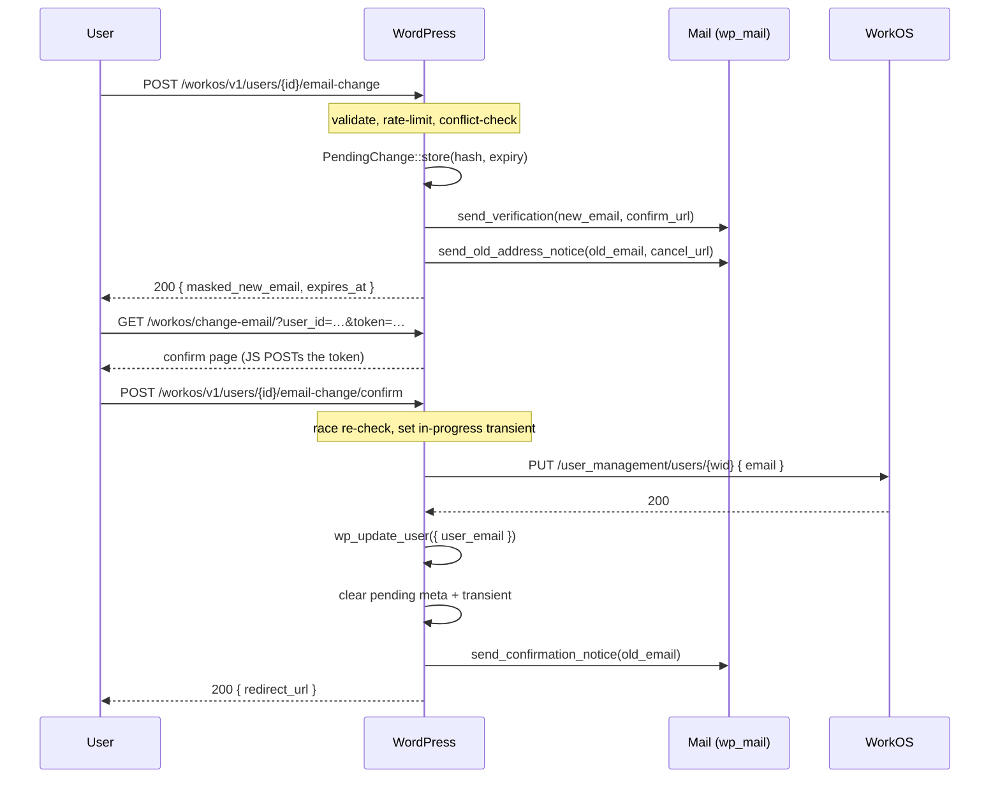

# Change Email

WorkOS-verified, conflict-guarded email-change flow for both self-service and admin-triggered scenarios.

This document covers every way to start, confirm, or cancel a WorkOS-backed email change for a WordPress user managed by `integration-workos`.

It is written for two audiences in parallel: a developer integrating against the plugin, and an LLM agent reading it as the source of truth for code-gen. The patterns and gotchas below are exhaustive — if your integration deviates from them, you are almost certainly hitting one of the **Don't do this** sections near the bottom.

> **Plugin requirement:** integration-workos **1.0.6** or later. Earlier versions do not expose the `email-change` endpoints, the `[workos:change-email]` shortcode, or the admin row action. The **WorkOS → Users** admin-page action and the admin-direct immediate-commit behavior (see [Admin-direct vs. self-service](#admin-direct-vs-self-service)) require **1.0.8** or later.

## Why this exists

WordPress lets an admin overwrite a user's `user_email` directly in `wp-admin/users.php` — no proof of ownership, no warning to the old address, no enforcement against collisions. For a WorkOS-backed deployment that's a footgun: an attacker who briefly compromises an admin session can pivot to "I own this account" by repointing the address.

This feature adds:

- A self-service `[workos:change-email]` shortcode that prompts the user for a new address and starts the flow.
- An admin "Change email" row action + user-edit panel + **WorkOS → Users** admin-page action that mirror the existing "Send password reset" surfaces.
- A WP-side hashed token + pending-state record so a self-service user's new address must be confirmed (clicked on) before the change commits.
- An old-address notice with a one-click cancel link (so a session-hijack victim can stop a change in progress).
- A configurable conflict policy that prevents the change from silently overwriting another local WP user's email.
- A WorkOS sync race guard so the `user.updated` webhook fan-back can't re-trigger the very mutation we just made.

The emailed-token verification protects **self-service**. An admin acting on *another* account can already manage every user, so they commit the change immediately — but routing it through this path is the point: it's conflict-checked, mirrored to WorkOS, race-guarded, and audit-logged, rather than the raw `users.php` field edit that does none of that. See [Admin-direct vs. self-service](#admin-direct-vs-self-service).

Verification is owned WP-side because WorkOS's `email_verification` endpoints verify the *current* address on a WorkOS user, not a pending change.

---

## At a glance

| Surface | Endpoint | Auth | Audience |
| --- | --- | --- | --- |
| Initiate (self-service) | `POST /wp-json/workos/v1/users/{id}/email-change` | WP REST nonce (`X-WP-Nonce`) + `edit_user($id)` | A logged-in user changing their own address |
| Initiate (admin-of-other) | Same endpoint | WP REST nonce + `edit_users` (and `initiator ≠ target`) | Editors / admins acting on another account — **commits immediately** |
| Confirm | `POST /wp-json/workos/v1/users/{id}/email-change/confirm` | The confirm **token** (no capability) | The person who clicked the verification link |
| Cancel | `POST /wp-json/workos/v1/users/{id}/email-change/cancel` | Cancel **token** *or* `edit_user($id)` | Old-address recipient, or an admin |
| WP Users list (row action under the WorkOS column) | Posts to the initiate endpoint | WP REST nonce + `edit_user($id)` | Admins, in the linked-user row only |
| WorkOS → Users admin page ("Change email" action) | Posts to the initiate endpoint | WP REST nonce + `edit_user($id)` | Admins, on the WorkOS user list |
| User-edit / profile panel | Posts to the initiate endpoint | WP REST nonce + `edit_user($id)` | Admins / the user on their own profile |
| Shortcode | `[workos:change-email]` | Rendered server-side; posts to the initiate endpoint | Page authors |

All entry points commit through the same shared path — a WorkOS `update_user` call followed by `wp_update_user()`, guarded by the conflict resolver and the in-progress transient. **Self-service** initiates email a hashed-token verification link and only commit on confirm (and are rate-limited); an **admin acting on another account** commits immediately, with no token, no rate limit, and no notification. See [Admin-direct vs. self-service](#admin-direct-vs-self-service).

> **Note:** Unlike the password-reset flow — whose *public* endpoints use a profile-scoped `X-WorkOS-Nonce` — **every** change-email endpoint uses the standard WordPress `X-WP-Nonce`. See [Don't do this](#dont-do-this).

---

## Flow



---

## Admin-direct vs. self-service

The initiate endpoint branches on **who is acting**, decided by `is_admin_action()`:

> The caller holds the `edit_users` capability **and** is not the target user.

That single condition is the trust boundary. A caller who clears it can already manage every account, so the flow drops the ceremony that exists to protect a self-service user (or a hijacked session) from an unverified change:

| Behavior | Self-service (or admin editing self) | Admin acting on another account |
| --- | --- | --- |
| Commit timing | On confirm, after the emailed token is clicked | **Immediately**, in the initiate request |
| Verification email | Sent to the new address | Not sent |
| Rate limiting | Per-IP + per-user windows enforced | Skipped |
| Old-address cancel notice | Sent (unless opted out) | Not sent |
| WP core "Notice of Email Change" | Sent | Suppressed for this commit |
| Conflict response | Enumeration-safe `200` (same shape as success) | Real `409 workos_change_email_conflict` |
| Success response | `{ ok, masked_new_email, expires_at }` | `{ ok: true, committed: true, email }` (unmasked — the admin typed it) |
| Activity-log event | `email_change.initiated` (then `…confirmed` on confirm) | `email_change.admin_changed` (`verified: false`) |

Editing *your own* address from an admin screen still counts as self-service — `is_admin_action()` is false when initiator == target — so an admin changing their own email gets the verified flow, not an immediate commit.

This is gated purely by capability; there is no setting to toggle it. It supersedes the `change_email_admin_bypass_verification` option from earlier 1.0.x builds, which has been removed.

---

## Endpoint reference

All endpoints live under `/wp-json/workos/v1/`. The initiate path requires the WP REST nonce **and** `edit_user($id)`; confirm and cancel are publicly routable (the token is the gatekeeper), but the shipped client still sends `X-WP-Nonce` on every request.

### `POST /wp-json/workos/v1/users/{id}/email-change` — initiate

Stores a pending change and emails the new address a confirmation link (and the old address a cancel link).

**Headers**

```
Content-Type: application/json
X-WP-Nonce: <wp_rest nonce>
```

**Body**

```jsonc
{
  "new_email": "jane.new@example.com",          // required
  "redirect_url": "/welcome"                     // optional — same-host; falls back to home_url('/')
}
```

**200 response** — enumeration-safe; the same shape is returned on success *and* on a conflict-block:

```json
{ "ok": true, "masked_new_email": "j•••@e•••.com", "expires_at": 1717948800 }
```

When the requested address equals the user's current address, no email is sent and the response carries a `no_op` flag instead of `expires_at`:

```json
{ "ok": true, "masked_new_email": "j•••@e•••.com", "no_op": true }
```

> **Note:** A conflict-blocked request returns this same `{ ok: true, masked_new_email }` shape (no `expires_at`) and writes an `email_change.conflict_blocked` row to the activity log. The block is **not** surfaced in the response — that's deliberate, so the endpoint can't be used to probe which addresses are taken. This applies to **self-service** callers; an admin acting on another account gets a real `409` instead (see below).

**Admin-direct 200 response (1.0.8+)** — when the caller is an admin acting on another account, the change is committed *in this request* (no confirm step). The body carries `committed: true` and the **unmasked** new address (the admin just typed it), with no `expires_at`:

```json
{ "ok": true, "committed": true, "email": "jane.new@example.com" }
```

See [Admin-direct vs. self-service](#admin-direct-vs-self-service) for the full behavior matrix.

**Errors**

| Status | Code | Cause |
| --- | --- | --- |
| 400 | `workos_invalid_user` | `id` path segment is not a positive integer |
| 400 | `workos_invalid_email` | `new_email` is empty or fails `is_email()` |
| 403 | `workos_forbidden` | Caller lacks `edit_user` on the target, or `workos_change_email_can_initiate` returned `false` |
| 404 | `workos_user_not_found` | No WP user with that ID |
| 409 | `workos_change_email_conflict` | New address already belongs to another account — **admin-of-other only**; self-service gets the enumeration-safe `200` instead |
| 429 | (rate-limit) | Per-IP or per-user initiate window exhausted (defaults: 10/IP/hr, 3/user/hr) — **self-service only**; admin-of-other actions bypass rate limiting |

> **Note:** An admin-of-other initiate commits in-request, so it can also return the `502` / `500` `workos_commit_failed` errors documented under [confirm](#post-wp-jsonworkosv1usersidemail-changeconfirm--confirm).

### `POST /wp-json/workos/v1/users/{id}/email-change/confirm` — confirm

Consumes the confirm token shipped in the verification email and commits the change to WorkOS, then WordPress.

**Headers**

```
Content-Type: application/json
X-WP-Nonce: <wp_rest nonce>
```

**Body**

```jsonc
{
  "token": "abc123…"                             // required — value of ?token= from the email link
}
```

The target user ID comes from the URL path (`/users/{id}/`), not the body. The optional `redirect_url` is honored if you pass it (validated same-host, falls back to `home_url('/')`).

**Behavior:** re-runs the conflict resolver (a collision can appear between initiate and confirm — race guard), sets a 60-second `_workos_email_change_in_progress_<user_id>` transient, calls `update_user` on WorkOS, mirrors with `wp_update_user`, clears the pending meta and the transient, then emails the old address a confirmation notice.

**200 response**

```json
{ "ok": true, "redirect_url": "https://site.example/welcome" }
```

**Errors**

| Status | Code | Cause |
| --- | --- | --- |
| 400 | `workos_invalid_request` | Missing token or non-positive `id` |
| 400 | `workos_invalid_token` | No pending record, unknown user, or token fails `hash_equals` |
| 410 | `workos_token_expired` | The pending record's `expires_at` has passed (record is cleared) |
| 409 | (conflict) | A confirm-time conflict appeared between initiate and confirm |
| 502 | `workos_commit_failed` | WorkOS `update_user` failed (nothing committed locally) |
| 500 | `workos_commit_failed` | `wp_update_user` failed after WorkOS succeeded — WorkOS is rolled back to the old address |

### `POST /wp-json/workos/v1/users/{id}/email-change/cancel` — cancel

Discards a pending change.

**Headers**

```
Content-Type: application/json
X-WP-Nonce: <wp_rest nonce>
```

**Body**

```jsonc
{
  "token": "def456…"                             // cancel token from the old-address notice;
                                                 // omit when relying on the edit_user capability path
}
```

**Auth:** EITHER a valid cancel token (from the old-address notice link) OR `edit_user` on the target.

**200 response**

```json
{ "ok": true }
```

If there is no pending change to cancel, the endpoint still returns `200 { ok: true }` so a double-clicked cancel link doesn't look like an error.

**Errors**

| Status | Code | Cause |
| --- | --- | --- |
| 403 | `workos_forbidden` | Neither a valid cancel token nor `edit_user` on the target |
| 404 | `workos_user_not_found` | No WP user with that ID |

---

## Settings

Stored under the active environment (`workos()->option(...)`); defaults are listed below.

| Option | Default | Purpose |
|---|---|---|
| `change_email_enabled` | `true` | Master switch. Also filterable: `workos_change_email_enabled`. |
| `change_email_conflict_policy` | `'block'` | `block` \| `allow_orphan` \| `merge_request`. |
| `change_email_token_lifetime` | `3600` | Seconds. Clamped to `[300, 86400]`. |
| `change_email_rate_limit_user_count` | `3` | Initiate attempts per user. |
| `change_email_rate_limit_user_window` | `3600` | Window in seconds. |
| `change_email_rate_limit_ip_count` | `10` | Initiate attempts per IP. |
| `change_email_rate_limit_ip_window` | `3600` | Window in seconds. |
| `change_email_notify_old_address` | `true` | Send the "change requested" + "change confirmed" notices to the old address. |
| `change_email_require_reauth` | `true` | Reserved for the AuthKit step-up flow. |
| `change_email_confirm_path` | `'workos/change-email'` | Rewrite path for the confirm route. Slash-trimmed; restricted to `[a-zA-Z0-9/_-]`. |

> An admin acting on another account commits without email verification by default — that's [admin-direct behavior](#admin-direct-vs-self-service), gated by the `edit_users` capability, not a setting. The earlier `change_email_admin_bypass_verification` option has been removed.

## Conflict policies

- **`block`** (default): a hard reject. The user-facing message is intentionally vague ("That email cannot be used for this account.") so the response can't be used to enumerate which addresses are taken. Logged as `email_change.conflict_blocked`.
- **`allow_orphan`**: permits the change when the conflicting WP user is unlinked from WorkOS (no `_workos_user_id`), has authored no posts, has authored no comments, and has been inactive for at least `workos_change_email_orphan_max_inactive_days` days (default 90, filterable). Audit-logged as a takeover. The conflicting account is not deleted — the email is simply reassigned.
- **`merge_request`**: rejects today (until Issue 2's merge flow ships), but fires `workos_change_email_merge_requested` so the future merge feature can observe.

---

## Examples

The examples below go from lowest-level (PHP, server-side) to highest-level (React/TSX), in the same order as [`password-reset.md`](password-reset.md). They are standalone — copy them into your own plugin or theme and adjust the namespacing. For the *shipped* client behavior (modal + inline form), see [`src/js/admin-change-email/index.ts`](../src/js/admin-change-email/index.ts) and [`src/js/change-email-confirm/index.ts`](../src/js/change-email-confirm/index.ts).

### Full PHP example — server-side admin trigger

Use this when your own plugin or theme needs to start an email change programmatically (e.g. from a custom REST endpoint, a WP-CLI command, or an admin action handler).

```php
<?php
/**
 * Start a WorkOS-verified email change for a WP user from your own code.
 *
 * Goes through the internal call path the REST endpoint uses, so
 * rate-limiting, capability checks, the conflict resolver, notifications,
 * and activity logging all apply identically.
 */
function my_plugin_start_workos_email_change( int $wp_user_id, string $new_email, string $redirect_url = '' ) {
    if ( ! is_user_logged_in() ) {
        return new WP_Error( 'forbidden', 'Must be logged in.' );
    }

    if ( ! current_user_can( 'edit_user', $wp_user_id ) ) {
        return new WP_Error( 'forbidden', 'You do not have permission to edit this user.' );
    }

    $request = new WP_REST_Request(
        'POST',
        '/workos/v1/users/' . $wp_user_id . '/email-change'
    );
    $request->set_header( 'Content-Type', 'application/json' );
    $request->set_body(
        wp_json_encode(
            [
                'new_email'    => $new_email,
                // Optional. Must be same-host; falls back to home_url('/') otherwise.
                'redirect_url' => $redirect_url,
            ]
        )
    );

    $response = rest_do_request( $request );

    if ( $response->is_error() ) {
        return $response->as_error();
    }

    $data = $response->get_data();
    // $data['masked_new_email'] is masked (e.g. "j•••@e•••.com") — safe to surface in UI.
    // $data['no_op'] is true when new_email already matches the current address.
    return $data;
}

// Example usage from a custom admin action.
add_action( 'admin_post_my_start_email_change', static function () {
    check_admin_referer( 'my_start_email_change' );

    $target_id    = absint( $_POST['user_id'] ?? 0 );
    $new_email    = sanitize_email( wp_unslash( $_POST['new_email'] ?? '' ) );
    $redirect_url = esc_url_raw( wp_unslash( $_POST['redirect_url'] ?? '' ) );

    $result = my_plugin_start_workos_email_change( $target_id, $new_email, $redirect_url );

    if ( is_wp_error( $result ) ) {
        wp_die( esc_html( $result->get_error_message() ), 'Email change failed', [ 'response' => 400 ] );
    }

    wp_safe_redirect( admin_url( 'users.php?email_change_sent=1' ) );
    exit;
} );
```

Why call into the internal endpoint instead of `workos()->api()->update_user()` directly? Three reasons:

1. The endpoint enforces `edit_user`, rate limits, the conflict resolver, and `redirect_url` validation in one place. Bypassing it duplicates that surface area in your code — and skips the **verification step entirely**, committing an unverified address.
2. It sends the verification email (new address) and the cancel-link notice (old address), and writes the `email_change.initiated` activity-log row — so audit history and the cancel safety-valve stay consistent.
3. It sets up the pending-state record and the webhook race guard that keep WorkOS and WordPress from fighting over the mutation. Skipping that machinery is exactly how a `user.updated` webhook re-triggers the change you just made.

For the low-level call, see [`WorkOS\Api\Client::update_user()`](../src/WorkOS/Api/Client.php) — but you almost never want it for an email change.

---

### Vanilla JS example — frontend self-service

Use this for a custom "Change my email" control on your theme's account page, outside the bundled shortcode/admin UI. It is the same contract the shipped [`admin-change-email/index.ts`](../src/js/admin-change-email/index.ts) uses.

```html
<!-- Markup -->
<form id="change-email-form" data-user-id="42">
    <input type="email" name="new_email" required placeholder="you@example.com" />
    <button type="submit">Change email</button>
    <p class="status" role="status" aria-live="polite"></p>
</form>
```

```html
<!-- Server-rendered config (in a theme template or via wp_localize_script) -->
<script>
    window.myChangeEmailConfig = {
        // Base REST URL — endpoint is `${restUrl}{id}/email-change`.
        restUrl: '<?php echo esc_js( rest_url( "workos/v1/users/" ) ); ?>',
        // Standard WP REST nonce — NOT a profile-scoped WorkOS nonce.
        nonce: '<?php echo esc_js( wp_create_nonce( "wp_rest" ) ); ?>',
        // The page the user should land on after they confirm. Must be same-host.
        redirectUrl: '<?php echo esc_js( home_url( "/account" ) ); ?>',
    };
</script>
```

```js
// Browser code.
( function () {
    const form   = document.getElementById( 'change-email-form' );
    const status = form.querySelector( '.status' );
    const cfg    = window.myChangeEmailConfig;
    const userId = form.getAttribute( 'data-user-id' );

    form.addEventListener( 'submit', async ( event ) => {
        event.preventDefault();
        status.textContent = 'Sending…';

        try {
            const response = await fetch( `${ cfg.restUrl }${ userId }/email-change`, {
                method: 'POST',
                credentials: 'same-origin',
                headers: {
                    'Content-Type': 'application/json',
                    // Change-email uses the standard WP REST nonce on every endpoint.
                    'X-WP-Nonce': cfg.nonce,
                },
                body: JSON.stringify( {
                    new_email: form.new_email.value,
                    redirect_url: cfg.redirectUrl,
                } ),
            } );

            const data = await response.json();

            if ( ! response.ok ) {
                // 429s and validation errors arrive here with data.code + data.message.
                status.textContent = data.message || 'Could not start the change. Please try again.';
                return;
            }

            if ( data.no_op ) {
                status.textContent = 'That is already your email address.';
                return;
            }

            // Always masked — never echo the raw address.
            status.textContent = `Check ${ data.masked_new_email } for a confirmation link.`;
        } catch ( err ) {
            status.textContent = 'Network error. Please try again.';
        }
    } );
} )();
```

> **Note:** The confirmation link in the email lands on the frontend confirm route (`/workos/change-email/?user_id=…&token=…`). That page **POSTs** the token to `/email-change/confirm` from JS — it never consumes the token on a `GET`, so an email-prefetch scanner can't burn it. If you build your own confirm page, do the same. See [`src/js/change-email-confirm/index.ts`](../src/js/change-email-confirm/index.ts).

---

### React + TypeScript example — admin trigger button

Use this when you're building a custom admin UI that lives outside this plugin — e.g. a SaaS dashboard's React surface — and need to start an email change for a specific WP user. (For the public self-service flow, prefer the bundled shortcode and admin surfaces.)

```tsx
// ChangeEmailButton.tsx
import { useState } from '@wordpress/element';
import { __, sprintf } from '@wordpress/i18n';

interface ChangeEmailConfig {
    /** Base URL — endpoint is `${baseUrl}{id}/email-change`. */
    baseUrl: string;
    /** WP REST nonce (`wp_rest`), refreshed when stale. */
    nonce: string;
}

interface Props {
    config: ChangeEmailConfig;
    /** Target WP user id. */
    userId: number;
    /** Optional same-host URL to land the user on after they confirm. */
    redirectUrl?: string;
    onSuccess?: ( maskedEmail: string, noOp: boolean ) => void;
    onError?: ( message: string ) => void;
}

interface SuccessResponse {
    ok: true;
    masked_new_email?: string;
    expires_at?: number;
    no_op?: boolean;
}

interface ErrorResponse {
    code?: string;
    message?: string;
}

export function ChangeEmailButton( {
    config,
    userId,
    redirectUrl = '',
    onSuccess,
    onError,
}: Props ) {
    const [ busy, setBusy ] = useState( false );

    const send = async () => {
        // Replace with your design system's prompt; the server validates the address.
        const newEmail = window.prompt( __( 'New email address for this user:', 'my-plugin' ) );
        if ( ! newEmail ) {
            return;
        }
        setBusy( true );

        try {
            const response = await fetch( `${ config.baseUrl }${ userId }/email-change`, {
                method: 'POST',
                credentials: 'same-origin',
                headers: {
                    'Content-Type': 'application/json',
                    // Change-email uses the standard WP REST nonce — never X-WorkOS-Nonce.
                    'X-WP-Nonce': config.nonce,
                },
                body: JSON.stringify( { new_email: newEmail, redirect_url: redirectUrl } ),
            } );

            const data = ( await response.json() ) as SuccessResponse | ErrorResponse;

            if ( ! response.ok ) {
                const err = data as ErrorResponse;
                onError?.( err.message ?? __( 'Could not start the change.', 'my-plugin' ) );
                return;
            }

            const ok = data as SuccessResponse;
            onSuccess?.(
                ok.masked_new_email ?? '',
                Boolean( ok.no_op )
            );
        } catch {
            onError?.( __( 'Network error.', 'my-plugin' ) );
        } finally {
            setBusy( false );
        }
    };

    return (
        <button type="button" disabled={ busy } onClick={ send }>
            { busy
                ? __( 'Sending…', 'my-plugin' )
                : __( 'Change email', 'my-plugin' ) }
        </button>
    );
}
```

**Wiring it up.** Pass the config from PHP via `wp_localize_script()`:

```php
wp_localize_script(
    'my-admin-bundle',
    'myChangeEmailConfig',
    [
        'baseUrl' => esc_url_raw( rest_url( 'workos/v1/users/' ) ),
        'nonce'   => wp_create_nonce( 'wp_rest' ),
    ]
);
```

> **Note:** The shipped admin client ([`src/js/admin-change-email/index.ts`](../src/js/admin-change-email/index.ts)) wraps this same call in a WP-styled modal (standalone trigger) or pulls the address from a `.workos-change-email-input` (form mode), keyed off `.workos-change-email-trigger`. Reuse those DOM hooks if you want the plugin's bundled behavior instead of your own component.

---

## Shortcode

```html
<!-- Self-service: pre-targets the logged-in user. -->
[workos:change-email]

<!-- Same with a redirect after confirm. -->
[workos:change-email redirect_url="/welcome"]

<!-- Admin-of-other (visible only when the viewer has edit_user on the target). -->
[workos:change-email user="42"]
[workos:change-email user="jane@example.com"]

<!-- Custom button label. -->
[workos:change-email label="Update my address"]
```

The shortcode silently renders nothing when:

- No `user` attribute and the viewer is logged out.
- The target user is not linked to WorkOS (no `_workos_user_id` meta).
- The viewer lacks `edit_user` on the target.

## Hooks

### Filters

- `workos_change_email_enabled` — master switch.
- `workos_change_email_conflict_policy` — request-time policy override (e.g. force `block` for HIPAA-tagged users).
- `workos_change_email_token_lifetime` — seconds, clamped to `[300, 86400]`.
- `workos_change_email_can_initiate` — `( bool $allowed, int $target_id, int $initiator_id )`.
- `workos_change_email_notify_old_address` — bool override for the opt-out gate.
- `workos_change_email_orphan_max_inactive_days` — inactivity threshold for `allow_orphan`.
- `workos_email_subject`, `workos_email_body`, `workos_email_headers` — shared email customization (used by all three change-email templates).

### Actions

- `workos_change_email_initiated` — `( int $user_id, string $new_email, int $initiated_by )`.
- `workos_change_email_confirmed` — `( int $user_id, string $old_email, string $new_email )`.
- `workos_change_email_cancelled` — `( int $user_id, string $reason )` where `$reason` is `'token'` or `'capability'`.
- `workos_change_email_conflict_detected` — `( int $target_user_id, string $new_email, int $conflicting_user_id, string $policy )`.
- `workos_change_email_merge_requested` — `( int $target_user_id, string $new_email, int $conflicting_user_id )`.

## Activity log events

- `email_change.initiated`
- `email_change.confirmed`
- `email_change.cancelled`
- `email_change.expired`
- `email_change.conflict_blocked`
- `email_change.commit_failed`
- `email_change.admin_changed` (an admin committing another account's change directly; metadata carries `verified: false` and `initiator_id`)

Each row records `{ user_id, user_email, workos_user_id, ip_address, metadata: { masked_new_email, masked_old_email, policy, initiator_id, self_service } }`.

Read via `\WorkOS\ActivityLog\EventLogger::get_events([ 'event_type' => 'email_change.initiated' ])`.

## Email templates

Templates live in `templates/change-email/` and are loaded by `WorkOS\Email\Mailer`. A theme can override any of them by placing a file at `wp-content/themes/{theme}/integration-workos/change-email/{name}.php` — the loader checks `locate_template()` first.

| Template | Recipient | Trigger |
|---|---|---|
| `verification-email.php` | **new** address | initiate |
| `old-address-notice.php` | **old** address | initiate (when `change_email_notify_old_address=true`) |
| `confirmation-notice.php` | **old** address | post-commit (when `change_email_notify_old_address=true`) |
| `confirm-page.php` | — | frontend confirm-route render |

## Security checklist

| Check | Implementation |
|---|---|
| Token hashing on storage | `hash_hmac('sha256', $token, wp_salt('auth'))` in `TokenFactory::hash()`. |
| Constant-time compare | `hash_equals()` in `TokenFactory::verify()`. |
| Single-use | Pending meta deleted on confirm/cancel/expiry; a second confirm finds no record. |
| Expiry enforced | `expires_at` checked before `hash_equals`; expired records are cleared as a side-effect. |
| Enumeration-safe initiate | Conflict-blocked responses share the same shape as success responses. |
| Rate limiting | Two `RateLimiter::attempt()` calls per initiate (per-IP, per-user). |
| Old-address notice | Default-on with a one-click cancel link. |
| CSRF / nonce | `X-WP-Nonce` required on every endpoint; capability checks on initiate and on the capability-mode cancel path. |
| Audit log | Every state transition is written to `{$wpdb->prefix}workos_activity_log`. |
| Webhook race | `_workos_email_change_in_progress_<user_id>` transient short-circuits `UserSync::handle_user_updated()` for 60s. |
| HTML-escape new email | `esc_html()` in templates; `sanitize_email()` on REST input. |

---

## Don't do this

This section catalogs the failure modes we've seen people hit. If your integration is misbehaving, scan here before opening an issue.

### ❌ Don't send `X-WorkOS-Nonce` to the change-email endpoints.

```js
// BAD — the profile-scoped X-WorkOS-Nonce belongs to the public /auth/* password endpoints.
fetch( '/wp-json/workos/v1/users/42/email-change', {
    headers: { 'X-WorkOS-Nonce': nonce },
} );
```

Every change-email endpoint uses the standard WordPress `X-WP-Nonce` (minted with `wp_create_nonce('wp_rest')`). This differs from password-reset, whose *public* `start`/`confirm` endpoints use `X-WorkOS-Nonce`. Mixing them up returns a 403.

### ❌ Don't consume the confirm or cancel token on a GET request.

```php
// BAD — a mail-prefetch scanner that fetches the link burns the token before the user clicks.
add_action( 'template_redirect', function () {
    if ( isset( $_GET['token'] ) ) {
        // committing the change here = single-use token consumed by a bot
    }
} );
```

The frontend route renders a page that **POSTs** the token to `/email-change/confirm` from JavaScript. Browsers and reasonable mail clients never POST on prefetch, so the token survives until the human acts. Keep the mutation on POST.

### ❌ Don't echo the raw new email from the response.

```js
// BAD
status.textContent = `Sent to ${ data.new_email }`; // there is no such field, and you shouldn't add one
```

The endpoint deliberately returns `masked_new_email` (`j•••@e•••.com`). Surface that, not the full address — operator-screen leakage is one of the easier audit findings to avoid.

### ❌ Don't treat a conflict-block as an error.

```js
// BAD — assuming a blocked address comes back as a 4xx.
if ( ! response.ok ) { showConflict(); }
```

A conflict-blocked initiate returns a **success-shaped 200** (`{ ok: true, masked_new_email }`, no `expires_at`) on purpose — that's what makes the endpoint enumeration-safe. The block is recorded as an `email_change.conflict_blocked` activity-log row, not in the response. If you need to know whether a block happened, read the log; don't infer it from the HTTP status.

### ❌ Don't call `workos()->api()->update_user()` directly to "change the email".

```php
// BAD — bypasses verification, the conflict resolver, the cancel safety-valve, and the audit log.
workos()->api()->update_user( $workos_user_id, [ 'email' => $new_email ] );
wp_update_user( [ 'ID' => $wp_user_id, 'user_email' => $new_email ] );
```

This is the exact footgun the feature exists to remove. It skips email verification (so an admin can repoint an account with no proof of ownership), skips the conflict policy, sends no old-address cancel link, writes nothing to the activity log, and races the `user.updated` webhook because it doesn't set the in-progress transient. Always route through `POST /users/{id}/email-change`.

### ❌ Don't strip the cancel link when overriding email templates.

If you override `old-address-notice.php` in your theme, keep the `$cancel_url` link. It's the one-click safety valve that lets a session-hijack victim stop a change in flight. A "prettier" template that drops it removes the only out-of-band recovery path.

---

## Tests

Six WPUnit suites under `tests/wpunit/`:

```
ChangeEmailTokenFactoryTest.php       # entropy + hashing + constant-time verify
ChangeEmailPendingChangeTest.php      # storage invariants + expiry + clear()
ChangeEmailConflictResolverTest.php   # block / allow_orphan / merge_request matrix
ChangeEmailNotifierTest.php           # recipient routing + opt-out gate
ChangeEmailRestApiTest.php            # 19 tests — initiate (self-service + admin-direct), confirm, cancel
ChangeEmailUserSyncRaceGuardTest.php  # the transient short-circuit
```

Run all change-email tests:

```bash
slic run wpunit --filter ChangeEmail
```

## Out of scope

- **Account merge.** When the conflict policy is `merge_request` we fire the hook but reject — the actual merge flow is tracked separately (Issue 2). Until that ships, `merge_request` behaves like `block` plus a future-facing hook fire.
- **Bulk email changes.** Each request handles a single user.
- **Username changes.** Only `user_email` is updated.

---

## Internal references

| Concept | Source |
| --- | --- |
| REST endpoints (initiate / confirm / cancel) | [`src/WorkOS/Auth/ChangeEmail/RestApi.php`](../src/WorkOS/Auth/ChangeEmail/RestApi.php) |
| Token generation / hashing / verify | [`src/WorkOS/Auth/ChangeEmail/TokenFactory.php`](../src/WorkOS/Auth/ChangeEmail/TokenFactory.php) |
| Pending-change storage (`_workos_pending_email_change`) | [`src/WorkOS/Auth/ChangeEmail/PendingChange.php`](../src/WorkOS/Auth/ChangeEmail/PendingChange.php) |
| Conflict policy resolver | [`src/WorkOS/Auth/ChangeEmail/ConflictResolver.php`](../src/WorkOS/Auth/ChangeEmail/ConflictResolver.php) |
| Email notifier (verification / old-address / confirmation) | [`src/WorkOS/Auth/ChangeEmail/Notifier.php`](../src/WorkOS/Auth/ChangeEmail/Notifier.php) |
| Shortcode | [`src/WorkOS/Auth/ChangeEmail/Shortcode.php`](../src/WorkOS/Auth/ChangeEmail/Shortcode.php) |
| Admin row action | [`src/WorkOS/Auth/ChangeEmail/RowActions.php`](../src/WorkOS/Auth/ChangeEmail/RowActions.php) |
| WorkOS → Users admin-page action (native button + modal) | [`src/js/admin-users/index.tsx`](../src/js/admin-users/index.tsx), config from [`src/WorkOS/Admin/Users/AdminPage.php`](../src/WorkOS/Admin/Users/AdminPage.php) |
| User-edit / profile panel | [`src/WorkOS/Auth/ChangeEmail/UserProfilePanel.php`](../src/WorkOS/Auth/ChangeEmail/UserProfilePanel.php) |
| Frontend confirm route | [`src/WorkOS/Auth/ChangeEmail/FrontendConfirmRoute.php`](../src/WorkOS/Auth/ChangeEmail/FrontendConfirmRoute.php) |
| Asset / localized-config registration | [`src/WorkOS/Auth/ChangeEmail/Assets.php`](../src/WorkOS/Auth/ChangeEmail/Assets.php) |
| Admin client (modal + form) | [`src/js/admin-change-email/index.ts`](../src/js/admin-change-email/index.ts) |
| Confirm-page client | [`src/js/change-email-confirm/index.ts`](../src/js/change-email-confirm/index.ts) |
| Email + confirm-page templates | [`templates/change-email/`](../templates/change-email/) |
| WorkOS API client (`update_user`) | [`src/WorkOS/Api/Client.php`](../src/WorkOS/Api/Client.php) |
| Password-reset flow (same admin-endpoint + shortcode pattern) | [`docs/password-reset.md`](password-reset.md) |

## External references

- WorkOS User Management API — Update a user: <https://workos.com/docs/reference/user-management/user/update>
- WordPress REST API nonces: <https://developer.wordpress.org/rest-api/using-the-rest-api/authentication/#cookie-authentication>
- WordPress `wp_update_user()`: <https://developer.wordpress.org/reference/functions/wp_update_user/>
