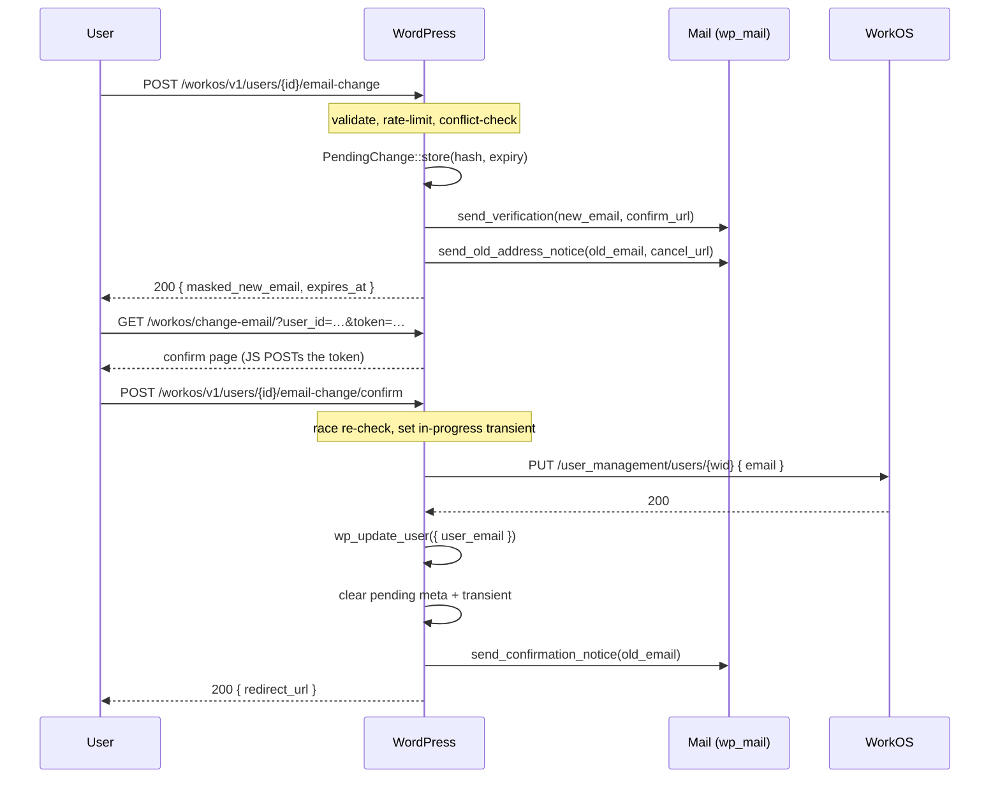

# Change Email

WorkOS-verified, conflict-guarded email-change flow for both self-service and admin-triggered scenarios.

## Why this exists

WordPress lets an admin overwrite a user's `user_email` directly in `wp-admin/users.php` — no proof of ownership, no warning to the old address, no enforcement against collisions. For a WorkOS-backed deployment that's a footgun: an attacker who briefly compromises an admin session can pivot to "I own this account" by repointing the address.

This feature adds:

- A self-service `[workos:change-email]` shortcode that prompts the user for a new address and starts the flow.
- An admin "Change email" row action + user-edit panel that mirrors the existing "Send password reset" surfaces.
- A WP-side hashed token + pending-state record so the new address must be confirmed (clicked on) before the change commits.
- An old-address notice with a one-click cancel link (so a session-hijack victim can stop a change in progress).
- A configurable conflict policy that prevents the change from silently overwriting another local WP user's email.
- A WorkOS sync race guard so the `user.updated` webhook fan-back can't re-trigger the very mutation we just made.

Verification is owned WP-side because WorkOS's `email_verification` endpoints verify the *current* address on a WorkOS user, not a pending change.

## Flow



## Endpoints

All under `/wp-json/workos/v1/`. Requests must include the WP REST nonce in `X-WP-Nonce`.

### `POST users/{id}/email-change`

Initiate a pending change.

- **Auth:** `current_user_can('edit_user', $id)` (admins-of-other + self via WP's default cap mapping).
- **Body:**
  ```json
  { "new_email": "jane.new@example.com", "redirect_url": "/welcome" }
  ```
- **Response (enumeration-safe, identical shape on success and on blocked-by-conflict):**
  ```json
  { "ok": true, "masked_new_email": "j•••@e•••.com", "expires_at": 1717948800 }
  ```

### `POST users/{id}/email-change/confirm`

Consume the token shipped in the verification email.

- **Auth:** the token itself.
- **Body:** `{ "token": "…" }`
- **Behavior:** re-runs the conflict resolver (a race can produce a new collision between initiate and confirm), sets a 60-second `_workos_email_change_in_progress_<user_id>` transient, calls `update_user` on WorkOS, mirrors with `wp_update_user`, clears the pending meta and the transient.
- **Errors:** `400` on bad/tampered token, `410` on expired, `409` on confirm-time conflict, `502` on a WorkOS API failure (with automatic rollback if `wp_update_user` also fails).

### `POST users/{id}/email-change/cancel`

Cancel a pending change.

- **Auth:** EITHER a valid cancel token (from the old-address notice link) OR `edit_user` on the target.
- **Body:** `{ "token": "…" }` for the token path; omit for the capability path.

## Settings

Stored under the active environment (`workos()->option(...)`); defaults are listed below.

| Option | Default | Purpose |
|---|---|---|
| `change_email_enabled` | `true` | Master switch. Also filterable: `workos_change_email_enabled`. |
| `change_email_conflict_policy` | `'block'` | `block` \| `allow_orphan` \| `merge_request`. |
| `change_email_token_lifetime` | `3600` | Seconds. Clamped to `[300, 86400]`. |
| `change_email_rate_limit_user_count` | `3` | Initiate attempts per user. |
| `change_email_rate_limit_user_window` | `3600` | Window in seconds. |
| `change_email_rate_limit_ip_count` | `10` | Initiate attempts per IP. |
| `change_email_rate_limit_ip_window` | `3600` | Window in seconds. |
| `change_email_notify_old_address` | `true` | Send the "change requested" + "change confirmed" notices to the old address. |
| `change_email_require_reauth` | `true` | Reserved for the AuthKit step-up flow. |
| `change_email_admin_bypass_verification` | `false` | When true, an admin with `edit_users` can commit without email verification (audit-logged via `email_change.admin_bypass`). |
| `change_email_confirm_path` | `'workos/change-email'` | Rewrite path for the confirm route. Slash-trimmed; restricted to `[a-zA-Z0-9/_-]`. |

## Conflict policies

- **`block`** (default): a hard reject. The user-facing message is intentionally vague ("That email cannot be used for this account.") so the response can't be used to enumerate which addresses are taken. Logged as `email_change.conflict_blocked`.
- **`allow_orphan`**: permits the change when the conflicting WP user is unlinked from WorkOS (no `_workos_user_id`), has authored no posts, has authored no comments, and has been inactive for at least `workos_change_email_orphan_max_inactive_days` days (default 90, filterable). Audit-logged as a takeover. The conflicting account is not deleted — the email is simply reassigned.
- **`merge_request`**: rejects today (until Issue 2's merge flow ships), but fires `workos_change_email_merge_requested` so the future merge feature can observe.

## Hooks

### Filters

- `workos_change_email_enabled` — master switch.
- `workos_change_email_conflict_policy` — request-time policy override (e.g. force `block` for HIPAA-tagged users).
- `workos_change_email_token_lifetime` — seconds, clamped to `[300, 86400]`.
- `workos_change_email_can_initiate` — `( bool $allowed, int $target_id, int $initiator_id )`.
- `workos_change_email_notify_old_address` — bool override for the opt-out gate.
- `workos_change_email_orphan_max_inactive_days` — inactivity threshold for `allow_orphan`.
- `workos_email_subject`, `workos_email_body`, `workos_email_headers` — shared email customization (used by all three change-email templates).

### Actions

- `workos_change_email_initiated` — `( int $user_id, string $new_email, int $initiated_by )`.
- `workos_change_email_confirmed` — `( int $user_id, string $old_email, string $new_email )`.
- `workos_change_email_cancelled` — `( int $user_id, string $reason )` where `$reason` is `'token'` or `'capability'`.
- `workos_change_email_conflict_detected` — `( int $target_user_id, string $new_email, int $conflicting_user_id, string $policy )`.
- `workos_change_email_merge_requested` — `( int $target_user_id, string $new_email, int $conflicting_user_id )`.

## Activity log events

- `email_change.initiated`
- `email_change.confirmed`
- `email_change.cancelled`
- `email_change.expired`
- `email_change.conflict_blocked`
- `email_change.commit_failed`
- `email_change.admin_bypass` (only when `change_email_admin_bypass_verification=true`)

Each row records `{ user_id, user_email, workos_user_id, ip_address, metadata: { masked_new_email, masked_old_email, policy, initiator_id, self_service } }`.

## Shortcode

```html
<!-- Self-service: pre-targets the logged-in user. -->
[workos:change-email]

<!-- Same with a redirect after confirm. -->
[workos:change-email redirect_url="/welcome"]

<!-- Admin-of-other (visible only when the viewer has edit_user on the target). -->
[workos:change-email user="42"]
[workos:change-email user="jane@example.com"]

<!-- Custom button label. -->
[workos:change-email label="Update my address"]
```

The shortcode silently renders nothing when:

- No `user` attribute and the viewer is logged out.
- The target user is not linked to WorkOS (no `_workos_user_id` meta).
- The viewer lacks `edit_user` on the target.

## Email templates

Templates live in `templates/change-email/` and are loaded by `WorkOS\Email\Mailer`. A theme can override any of them by placing a file at `wp-content/themes/{theme}/integration-workos/change-email/{name}.php` — the loader checks `locate_template()` first.

| Template | Recipient | Trigger |
|---|---|---|
| `verification-email.php` | **new** address | initiate |
| `old-address-notice.php` | **old** address | initiate (when `change_email_notify_old_address=true`) |
| `confirmation-notice.php` | **old** address | post-commit (when `change_email_notify_old_address=true`) |
| `confirm-page.php` | — | frontend confirm-route render |

## Security checklist

| Check | Implementation |
|---|---|
| Token hashing on storage | `hash_hmac('sha256', $token, wp_salt('auth'))` in `TokenFactory::hash()`. |
| Constant-time compare | `hash_equals()` in `TokenFactory::verify()`. |
| Single-use | Pending meta deleted on confirm/cancel/expiry; a second confirm finds no record. |
| Expiry enforced | `expires_at` checked before `hash_equals`; expired records are cleared as a side-effect. |
| Enumeration-safe initiate | Conflict-blocked responses share the same shape as success responses. |
| Rate limiting | Two `RateLimiter::attempt()` calls per initiate (per-IP, per-user). |
| Old-address notice | Default-on with a one-click cancel link. |
| CSRF / nonce | `X-WP-Nonce` required on every endpoint; capability checks on initiate and on the capability-mode cancel path. |
| Audit log | Every state transition is written to `{$wpdb->prefix}workos_activity_log`. |
| Webhook race | `_workos_email_change_in_progress_<user_id>` transient short-circuits `UserSync::handle_user_updated()` for 60s. |
| HTML-escape new email | `esc_html()` in templates; `sanitize_email()` on REST input. |

## Tests

Six WPUnit suites under `tests/wpunit/`:

```
ChangeEmailTokenFactoryTest.php       # entropy + hashing + constant-time verify
ChangeEmailPendingChangeTest.php      # storage invariants + expiry + clear()
ChangeEmailConflictResolverTest.php   # block / allow_orphan / merge_request matrix
ChangeEmailNotifierTest.php           # recipient routing + opt-out gate
ChangeEmailRestApiTest.php            # 13 tests covering initiate / confirm / cancel
ChangeEmailUserSyncRaceGuardTest.php  # the transient short-circuit
```

Run all change-email tests:

```bash
slic run wpunit --filter ChangeEmail
```

## Out of scope

- **Account merge.** When the conflict policy is `merge_request` we fire the hook but reject — the actual merge flow is tracked separately (Issue 2). Until that ships, `merge_request` behaves like `block` plus a future-facing hook fire.
- **Bulk email changes.** Each request handles a single user.
- **Username changes.** Only `user_email` is updated.
