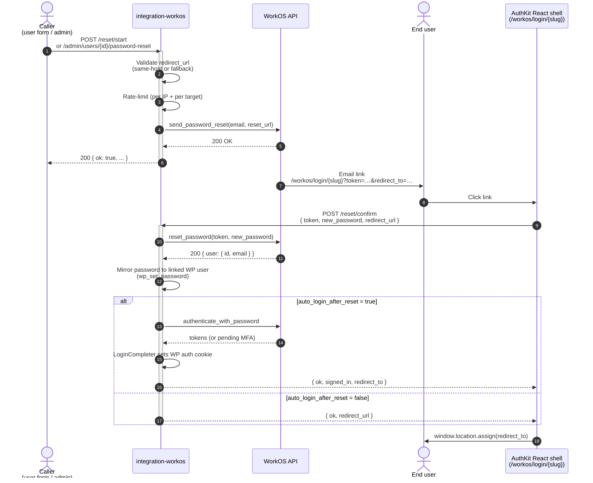

# Password Reset API

This document covers every way to trigger or complete a WorkOS-backed password reset for a WordPress user managed by `integration-workos`.

It is written for two audiences in parallel: a developer integrating against the plugin, and an LLM agent reading it as the source of truth for code-gen. The patterns and gotchas below are exhaustive — if your integration deviates from them, you are almost certainly hitting one of the **Don't do this** sections at the bottom.

> **Plugin requirement:** integration-workos **1.0.5** or later. Earlier versions only expose the `start` and `confirm` endpoints under the legacy `wp-login.php` URL.

---

## At a glance

| Surface | Endpoint | Auth | Audience |
| --- | --- | --- | --- |
| Self-service start | `POST /wp-json/workos/v1/auth/password/reset/start` | Profile-scoped nonce | Anyone (anonymous OK) |
| Self-service confirm | `POST /wp-json/workos/v1/auth/password/reset/confirm` | Profile-scoped nonce | Anyone with a valid reset token |
| Admin-triggered | `POST /wp-json/workos/v1/admin/users/{id}/password-reset` | WP REST nonce + `edit_user($id)` capability | Editors / admins (also covers self-service from a logged-in context) |
| WP Users list (row action under the WorkOS column) | Posts to the admin endpoint | WP REST nonce + `edit_user($id)` | Admins, in the linked-user row only |
| Shortcode | `[workos:password-reset]` | Rendered server-side; uses admin endpoint | Page authors |

All three converge on the same WorkOS API call (`POST /user_management/password_reset/send`), and all three honor the same `redirect_url` and profile policy (`password_reset_flow`, `auto_login_after_reset`).

---

## End-to-end flow



---

## Endpoint reference

### Public: `POST /wp-json/workos/v1/auth/password/reset/start`

Sends the WorkOS reset email. The endpoint always returns `200` whether or not the email matches a real account — that prevents account enumeration. Response time is also flattened (~900 ms floor) for the same reason.

**Headers**

```
Content-Type: application/json
X-WorkOS-Nonce: <profile-scoped nonce>
```

**Body**

```jsonc
{
  "profile": "default",                          // required — Login Profile slug
  "email": "user@example.com",                   // required
  "redirect_url": "https://site.example/welcome" // optional — same-host required, falls back to profile.post_login_redirect or home_url('/')
}
```

**200 response** (always 200 unless rate-limited or input invalid)

```json
{
  "ok": true,
  "message": "If an account exists for this email, a password reset link is on its way."
}
```

**Rate limits**

- `10` attempts per IP per `60s` window.
- `5` attempts per email per `60s` window.

A 429 returns `WP_Error` with `retry_after` in the data array.

---

### Public: `POST /wp-json/workos/v1/auth/password/reset/confirm`

Completes the reset. Reads the token from the URL the user clicked in the email.

**Headers**

```
Content-Type: application/json
X-WorkOS-Nonce: <profile-scoped nonce>
```

**Body**

```jsonc
{
  "profile": "default",                          // required
  "token": "abc123…",                            // required — value of ?token= from the email link
  "new_password": "S0meStrongPa$$w0rd!",         // required — see "Password strength" below
  "redirect_url": "https://site.example/welcome" // optional — overrides anything carried in the URL
}
```

**200 response** — three shapes depending on profile config and WorkOS state:

1. **Plain reset** (toggle `auto_login_after_reset` is off):

   ```json
   {
     "ok": true,
     "redirect_url": "https://site.example/welcome"
   }
   ```

2. **Auto-login** (toggle on, no MFA):

   ```json
   {
     "ok": true,
     "redirect_url": "https://site.example/welcome",
     "signed_in": true,
     "user": { "id": 42, "email": "user@example.com", "display_name": "User" },
     "redirect_to": "https://site.example/welcome"
   }
   ```

   A WP auth cookie has been set; the linked WP user's password has been mirrored to match.

3. **Auto-login with MFA required**:

   ```json
   {
     "ok": true,
     "redirect_url": "https://site.example/welcome",
     "mfa_required": true,
     "pending_authentication_token": "pending_xyz",
     "factors": [ { "id": "auth_factor_…", "type": "totp" } ]
   }
   ```

   Submit `pending_authentication_token` + factor code to `/wp-json/workos/v1/auth/mfa/verify` to finish.

**Rate limits**

- `10` attempts per IP per `60s` window. (No per-email bucket here; the token already gates against arbitrary callers.)

---

### Admin: `POST /wp-json/workos/v1/admin/users/{id}/password-reset`

Sends a reset email on behalf of any user the caller has `edit_user($id)` capability on. WordPress grants that capability on one's own user ID, so the same endpoint covers both **admin-of-another** and **self-service** call paths.

**Headers**

```
Content-Type: application/json
X-WP-Nonce: <wp_rest nonce>
```

**Body** (all optional)

```jsonc
{
  "redirect_url": "https://site.example/welcome", // optional — same-host required
  "profile": "default"                            // optional — defaults to the canonical default profile
}
```

**200 response**

```json
{
  "ok": true,
  "email_hint": "u•••@e•••.com",
  "profile": "default",
  "redirect_url": "https://site.example/welcome"
}
```

`email_hint` is intentionally masked — never echo the full target email in UI.

**Errors**

| Status | Code | Cause |
| --- | --- | --- |
| 400 | `workos_invalid_user` | `id` path segment is not a positive integer |
| 400 | `workos_reset_disabled` | Profile has `password_reset_flow=false` |
| 403 | `workos_forbidden` | Caller lacks `edit_user` on the target |
| 404 | `workos_user_not_found` | No WP user with that ID |
| 409 | `workos_user_not_linked` | WP user exists but has no `_workos_user_id` meta |
| 409 | `workos_user_missing_email` | WP user has no usable email address |
| 429 | `workos_rate_limited` | Rate-limit window exhausted (10/IP/min, 5/target-user/min) |

Every successful call writes a `password_reset.admin_sent` row to the activity log (`{$wpdb->prefix}workos_activity_log`) with the initiator id, target id, profile slug, redirect URL, and a `self_service` flag.

---

## Profile policy

Each Login Profile exposes three settings that govern the flow:

| Setting | Default | Effect |
| --- | --- | --- |
| `password_reset_flow` | `true` | When `false`, all three endpoints return `workos_reset_disabled`. Reset emails can't be sent and `?token=` links can't be redeemed. |
| `auto_login_after_reset` | `true` | When `true`, a successful `confirm` re-authenticates the user with their new password and sets the WP auth cookie. MFA still runs. |
| `post_login_redirect` | `''` (home) | Default destination when no `redirect_url` is supplied. |

Toggle them in **WorkOS → Login Profiles → {profile}**.

---

## Password strength + confirmation

The React reset-confirm step renders **two password fields** and scores the value via WordPress's bundled `wp.passwordStrength.meter` (zxcvbn-backed). Submit is disabled until:

- Both fields match exactly, AND
- zxcvbn score reaches `Strong` (≥ 3 out of 4).

The site name plus the strings `wordpress` and `admin` are passed as the zxcvbn disallowed list, so reusing those loses strength points.

When zxcvbn is still streaming in, the meter reports `Checking strength…` rather than gating on a transient.

> If you're calling the `confirm` endpoint from your own UI, **you** own enforcing this gate. The server accepts any non-empty `new_password`.

---

## Redirect URL validation

`redirect_url` accepts:

- Absolute URLs whose host equals `home_url()`'s host.
- Site-relative paths (e.g. `/welcome` → resolved against `home_url()`).

It rejects, falling back to `profile.post_login_redirect` → `home_url('/')`:

- Cross-origin absolute URLs.
- Protocol-relative URLs (`//evil.example/x`).
- Non-`http(s)` schemes (`javascript:`, `data:`, etc.).

The validation runs on every endpoint that accepts `redirect_url` (start, confirm, admin-trigger) and on the server side, so a malicious client can't bypass it.

---

## Examples

### Full PHP example — server-side admin trigger

Use this when your own plugin or theme needs to trigger a reset programmatically (e.g. from a custom REST endpoint, a WP-CLI command, or an admin action handler).

```php
<?php
/**
 * Send a WorkOS password reset email for a WP user from your own code.
 *
 * Goes through the internal call path the admin REST endpoint uses, so
 * rate-limiting, capability checks, profile resolution, and activity
 * logging all apply identically.
 */
function my_plugin_trigger_workos_password_reset( int $wp_user_id, string $redirect_url = '' ) {
    if ( ! is_user_logged_in() ) {
        return new WP_Error( 'forbidden', 'Must be logged in.' );
    }

    if ( ! current_user_can( 'edit_user', $wp_user_id ) ) {
        return new WP_Error( 'forbidden', 'You do not have permission to edit this user.' );
    }

    $request = new WP_REST_Request(
        'POST',
        '/workos/v1/admin/users/' . $wp_user_id . '/password-reset'
    );
    $request->set_header( 'Content-Type', 'application/json' );
    $request->set_body(
        wp_json_encode(
            [
                // Optional. Must be same-host; falls back to profile default otherwise.
                'redirect_url' => $redirect_url,
                // Optional. Defaults to the canonical "default" Login Profile.
                'profile'      => 'default',
            ]
        )
    );

    $response = rest_do_request( $request );

    if ( $response->is_error() ) {
        return $response->as_error();
    }

    $data = $response->get_data();
    // $data['email_hint'] is masked (e.g. "j•••@e•••.com") — safe to surface in UI.
    return $data;
}

// Example usage from a custom admin action.
add_action( 'admin_post_my_send_reset', static function () {
    check_admin_referer( 'my_send_reset' );

    $target_id    = absint( $_POST['user_id'] ?? 0 );
    $redirect_url = esc_url_raw( $_POST['redirect_url'] ?? home_url( '/' ) );

    $result = my_plugin_trigger_workos_password_reset( $target_id, $redirect_url );

    if ( is_wp_error( $result ) ) {
        wp_die( esc_html( $result->get_error_message() ), 'Reset failed', [ 'response' => 400 ] );
    }

    wp_safe_redirect( admin_url( 'users.php?reset_sent=1' ) );
    exit;
} );
```

Why call into the internal endpoint instead of `workos()->api()->send_password_reset()` directly? Three reasons:

1. The endpoint enforces `edit_user`, rate limits, profile gating, and `redirect_url` validation in one place. Bypassing it duplicates that surface area in your code.
2. It writes the `password_reset.admin_sent` activity-log row — so audit history stays consistent.
3. It builds the URL via `FrontendRoute::url_for_profile()`, picking up any host-side `home_url` filter that escapes ampersands. Skipping that machinery is exactly how broken reset links land in inboxes.

If you absolutely need the lower-level call, see [`WorkOS\Api\Client::send_password_reset()`](../src/WorkOS/Api/Client.php).

---

### Vanilla JS example — frontend self-service

Use this for a custom "Forgot password?" link on your theme's login page, outside the AuthKit React shell.

```html
<!-- Markup -->
<form id="forgot-form">
    <input type="email" name="email" required placeholder="you@example.com" />
    <button type="submit">Send reset link</button>
    <p class="status" role="status" aria-live="polite"></p>
</form>
```

```html
<!-- Server-rendered config (in a theme template or via wp_localize_script) -->
<script>
    window.myResetConfig = {
        endpoint: '<?php echo esc_js( rest_url( "workos/v1/auth/password/reset/start" ) ); ?>',
        // Per-profile nonce (NOT wp_rest). Mint via the same Nonce helper the
        // AuthKit shell uses — see src/WorkOS/Auth/AuthKit/Nonce.php.
        nonce: '<?php echo esc_js( ( new \WorkOS\Auth\AuthKit\Nonce() )->mint( "default" ) ); ?>',
        profile: 'default',
        // The page the user should land on after they finish resetting. Must be same-host.
        redirectUrl: '<?php echo esc_js( home_url( "/welcome" ) ); ?>',
    };
</script>
```

```js
// Browser code.
( function () {
    const form   = document.getElementById( 'forgot-form' );
    const status = form.querySelector( '.status' );
    const cfg    = window.myResetConfig;

    form.addEventListener( 'submit', async ( event ) => {
        event.preventDefault();
        status.textContent = 'Sending…';

        try {
            const response = await fetch( cfg.endpoint, {
                method: 'POST',
                credentials: 'same-origin',
                headers: {
                    'Content-Type'   : 'application/json',
                    // Note the header name — the public auth endpoints use the
                    // profile-scoped X-WorkOS-Nonce, not X-WP-Nonce.
                    'X-WorkOS-Nonce' : cfg.nonce,
                },
                body: JSON.stringify( {
                    profile      : cfg.profile,
                    email        : form.email.value,
                    redirect_url : cfg.redirectUrl,
                } ),
            } );

            const data = await response.json();

            if ( ! response.ok ) {
                // 429s arrive here with data.code === 'workos_rate_limited'.
                status.textContent = data.message || 'Could not send the email. Please try again.';
                return;
            }

            // Server always returns 200 to prevent account enumeration.
            status.textContent = data.message;
        } catch ( err ) {
            status.textContent = 'Network error. Please try again.';
        }
    } );
} )();
```

**The hidden gotcha:** the per-profile nonce is rotated every WP nonce tick (~12h by default). Long-lived single-page apps must re-fetch the nonce after a 403 response, not hard-fail.

---

### React + TypeScript example — admin trigger button

Use this when you're building a custom admin UI that lives outside this plugin — e.g. a SaaS dashboard's React surface — and need to trigger a reset for a specific WP user. (For the public self-service flow, use the bundled AuthKit shell instead of writing your own.)

```tsx
// SendResetButton.tsx
import { useState } from '@wordpress/element';
import { __, sprintf } from '@wordpress/i18n';

interface SendResetConfig {
    /** Base URL — admin endpoint is `${baseUrl}{id}/password-reset`. */
    baseUrl: string;
    /** WP REST nonce (`wp_rest`), refreshed when stale. */
    nonce: string;
}

interface Props {
    config: SendResetConfig;
    /** Target WP user id. */
    userId: number;
    /** Optional same-host URL to land the user on after they reset. */
    redirectUrl?: string;
    /** Optional Login Profile slug — defaults to "default" server-side. */
    profile?: string;
    onSuccess?: ( emailHint: string ) => void;
    onError?: ( message: string ) => void;
}

interface SuccessResponse {
    ok: true;
    email_hint: string;
    redirect_url: string;
}

interface ErrorResponse {
    code?: string;
    message?: string;
}

export function SendResetButton( {
    config,
    userId,
    redirectUrl = '',
    profile = '',
    onSuccess,
    onError,
}: Props ) {
    const [ busy, setBusy ] = useState( false );

    const send = async () => {
        if ( ! window.confirm( __( 'Send a password reset email to this user?', 'my-plugin' ) ) ) {
            return;
        }
        setBusy( true );

        try {
            const response = await fetch( `${ config.baseUrl }${ userId }/password-reset`, {
                method: 'POST',
                credentials: 'same-origin',
                headers: {
                    'Content-Type': 'application/json',
                    // Admin endpoint uses the standard WP REST nonce.
                    'X-WP-Nonce'  : config.nonce,
                },
                body: JSON.stringify( { redirect_url: redirectUrl, profile } ),
            } );

            const data = ( await response.json() ) as
                | SuccessResponse
                | ErrorResponse;

            if ( ! response.ok ) {
                const err = data as ErrorResponse;
                onError?.( err.message ?? __( 'Could not send the email.', 'my-plugin' ) );
                return;
            }

            const ok = data as SuccessResponse;
            onSuccess?.( ok.email_hint );
        } catch {
            onError?.( __( 'Network error.', 'my-plugin' ) );
        } finally {
            setBusy( false );
        }
    };

    return (
        <button type="button" disabled={ busy } onClick={ send }>
            { busy
                ? __( 'Sending…', 'my-plugin' )
                : __( 'Send password reset', 'my-plugin' ) }
        </button>
    );
}
```

**Wiring it up.** Pass the config from PHP via `wp_localize_script()`:

```php
wp_localize_script(
    'my-admin-bundle',
    'mySendResetConfig',
    [
        'baseUrl' => esc_url_raw( rest_url( 'workos/v1/admin/users/' ) ),
        'nonce'   => wp_create_nonce( 'wp_rest' ),
    ]
);
```

---

## Shortcode reference

```
[workos:password-reset
    user="42"                              # WP user id OR email. Omit for self-service.
    redirect_url="/dashboard"              # Optional same-host URL.
    profile="default"                      # Optional Login Profile slug.
    label="Reset my password"              # Optional button label.
]
```

**Modes**

- **Admin-of-other:** `user="42"` — renders only when the viewer has `edit_user(42)`.
- **Self-service:** no `user` attribute — renders for the current logged-in user only.

In both cases the click POSTs to the admin endpoint with the WP REST nonce.

---

## Activity log

Successful admin-triggered sends append a row to `{$wpdb->prefix}workos_activity_log`:

| Column | Value |
| --- | --- |
| `event_type` | `password_reset.admin_sent` |
| `user_id` | Target WP user ID |
| `user_email` | Target email (in plaintext — column is internal) |
| `workos_user_id` | Linked WorkOS user ID |
| `metadata` | JSON: `{ profile, redirect_url, initiator_id, self_service }` |

Read via `\WorkOS\ActivityLog\EventLogger::get_events([ 'event_type' => 'password_reset.admin_sent' ])`.

---

## Don't do this

This section catalogs the failure modes we've seen people hit. If your integration is misbehaving, scan here before opening an issue.

### ❌ Don't call WorkOS directly to send the reset email.

```php
// BAD — bypasses the URL builder, rate limits, profile gating, activity log.
workos()->api()->send_password_reset( $email, 'https://example.com/whatever' );
```

The URL you hand WorkOS gets emailed verbatim. Get the host wrong and the email link is dead. Skip the entity-decode and a host-side `home_url` filter will silently break it. Always route through `POST /admin/users/{id}/password-reset` or `POST /auth/password/reset/start`.

### ❌ Don't store reset tokens or replay them.

The token in `?token=…` is single-use and validated by WorkOS, not this plugin. Capturing it in your own database serves no purpose and creates a credential surface you have to protect. Just hand it to `POST /auth/password/reset/confirm` once.

### ❌ Don't trust the `redirect_url` you got from URL parameters without re-validating.

```js
// BAD — pulls redirect_to from the URL and uses it directly.
const params = new URLSearchParams( window.location.search );
window.location.assign( params.get( 'redirect_to' ) ); // open redirect
```

The server already validates `redirect_url` against `home_url()`, but only when it travels through the endpoint payload. If you're consuming a URL parameter directly in JS, run it back through `wp_validate_redirect()` (or its same-host equivalent in your stack) before navigating.

### ❌ Don't echo the user's email from the admin response.

```js
// BAD
status.textContent = `Sent to ${ data.email }`;
```

The endpoint deliberately returns `email_hint` (`u•••@e•••.com`) instead of the full address. Don't undo that — operator-screen leakage is one of the easier audit findings to avoid.

### ❌ Don't skip the password-strength gate when you write your own reset UI.

The server accepts any non-empty `new_password`. The strength meter is an in-shell UX gate, not an API-level one. If you're writing a custom reset form (instead of using the bundled AuthKit shell), reproduce the zxcvbn check in your UI — otherwise users can set `password` and `123456` against the WorkOS account.

### ❌ Don't assume a 200 from `/reset/start` means the email exists.

The endpoint **always** returns 200 (with a fixed ~900 ms response-time floor) to prevent account enumeration. If you need to know whether the email is registered, ask via a different surface (a separate authenticated lookup), not this one.

### ❌ Don't hard-code `wp-login.php` as the reset URL.

Reset emails point at `/workos/login/{slug}` since 1.0.5. Legacy `wp-login.php?workos_action=reset-password` links still resolve (via `LoginTakeover`), but new code should never build that URL by hand. Let the endpoint construct it via `FrontendRoute::url_for_profile()`.

### ❌ Don't use `X-WP-Nonce` for the public auth endpoints.

```js
// BAD — X-WP-Nonce works for the admin endpoint, NOT for /auth/*.
fetch( '/wp-json/workos/v1/auth/password/reset/start', {
    headers: { 'X-WP-Nonce': nonce },
} );
```

Public auth endpoints use a profile-scoped nonce in the **`X-WorkOS-Nonce`** header. (We deliberately avoid `X-WP-Nonce` to prevent collisions with other plugins.) Admin endpoints under `/admin/*` use the standard `X-WP-Nonce`. Mixing them returns 403.

### ❌ Don't disable `auto_login_after_reset` because "session management is hard".

When the toggle is off, the user is left on a "Continue to sign in" card after a successful reset — they then have to re-authenticate. That sounds safer; it isn't. With it on, `LoginCompleter` still runs every gate the rest of your auth surfaces apply (MFA, organization selection, entitlement gate). Leave it on unless you have a specific reason (e.g. you want to require a captcha on every login).

---

## Internal references

| Concept | Source |
| --- | --- |
| Public REST endpoints | [`src/WorkOS/REST/Auth/Password.php`](../src/WorkOS/REST/Auth/Password.php) |
| Admin REST endpoint | [`src/WorkOS/Auth/PasswordResetAdmin/RestApi.php`](../src/WorkOS/Auth/PasswordResetAdmin/RestApi.php) |
| Shortcode | [`src/WorkOS/Auth/PasswordResetAdmin/Shortcode.php`](../src/WorkOS/Auth/PasswordResetAdmin/Shortcode.php) |
| Redirect URL validator | [`src/WorkOS/Auth/PasswordResetAdmin/RedirectValidator.php`](../src/WorkOS/Auth/PasswordResetAdmin/RedirectValidator.php) |
| URL builder helper | [`FrontendRoute::url_for_profile()`](../src/WorkOS/Auth/AuthKit/FrontendRoute.php) |
| Profile toggles | [`src/WorkOS/Auth/AuthKit/Profile.php`](../src/WorkOS/Auth/AuthKit/Profile.php) (`is_password_reset_flow_enabled`, `is_auto_login_after_reset_enabled`) |
| WorkOS API client | [`WorkOS\Api\Client::send_password_reset()` / `::reset_password()`](../src/WorkOS/Api/Client.php) |
| React `ResetConfirm` step | [`src/js/authkit/flows.tsx`](../src/js/authkit/flows.tsx) |

## External references

- WorkOS User Management API — Password reset: <https://workos.com/docs/reference/user-management/authentication/password-reset>
- WorkOS Radar (anti-fraud action tokens, threaded through every endpoint): <https://workos.com/docs/radar>
- WordPress REST API nonces: <https://developer.wordpress.org/rest-api/using-the-rest-api/authentication/#cookie-authentication>
- WordPress `wp.passwordStrength.meter`: <https://developer.wordpress.org/reference/files/wp-admin/js/password-strength-meter.js/>
- zxcvbn (the score engine): <https://github.com/dropbox/zxcvbn>
